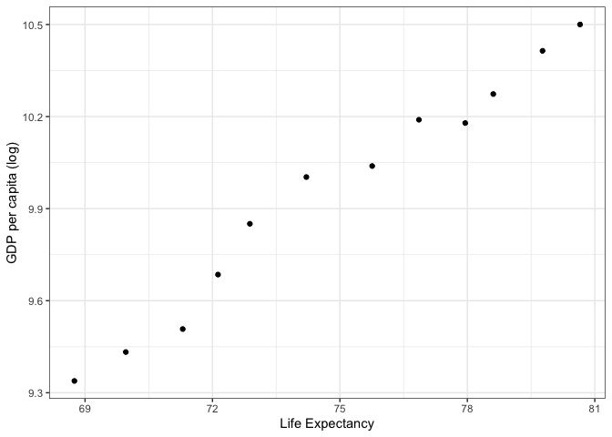
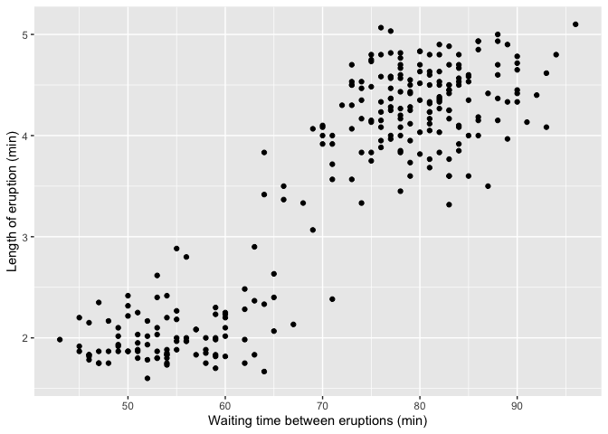
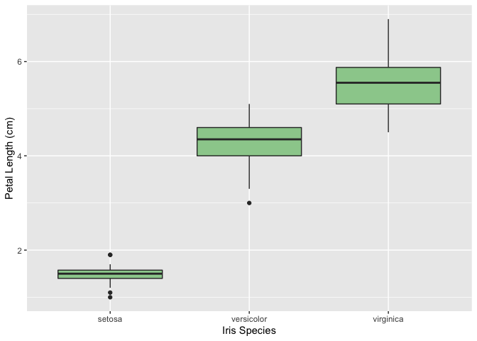

```r
suppressPackageStartupMessages(library(dplyr))  
suppressPackageStartupMessages(library(gapminder))
suppressPackageStartupMessages(library(ggplot2))
suppressPackageStartupMessages(library(tidyr))
```


# Homework 2: Exploring gapminder using dplyr

## Exercise 1: Basic dplyr

1.1 Use filter() to subset the gapminder data to three countries of your choice in the 1970’s.

```r
gapminder %>%
  filter(country == "Canada" | country == "Bolivia" | country == "Turkey") %>% 
  filter(year == 1972 | year == 1977)
```

```
## # A tibble: 6 x 6
##   country continent  year lifeExp      pop gdpPercap
##   <fct>   <fct>     <int>   <dbl>    <int>     <dbl>
## 1 Bolivia Americas   1972    46.7  4565872     2980.
## 2 Bolivia Americas   1977    50.0  5079716     3548.
## 3 Canada  Americas   1972    72.9 22284500    18971.
## 4 Canada  Americas   1977    74.2 23796400    22091.
## 5 Turkey  Europe     1972    57.0 37492953     3451.
## 6 Turkey  Europe     1977    59.5 42404033     4269.
```

1.2 Use the pipe operator %>% to select “country” and “gdpPercap” from your filtered dataset in 1.1.

```r
gapminder %>%
  filter(country == "Canada" | country == "Bolivia" | country == "Turkey") %>% 
  filter(year == 1972 | year == 1977) %>% 
  select(country, gdpPercap)
```

```
## # A tibble: 6 x 2
##   country gdpPercap
##   <fct>       <dbl>
## 1 Bolivia     2980.
## 2 Bolivia     3548.
## 3 Canada     18971.
## 4 Canada     22091.
## 5 Turkey      3451.
## 6 Turkey      4269.
```

1.3 Filter gapminder to all entries that have experienced a drop in life expectancy. Be sure to include a new variable that’s the increase in life expectancy in your tibble. Hint: you might find the lag() or diff() functions useful.

```r
gapminder %>% 
  mutate(lifeExp_inc = lifeExp - lag(lifeExp)) %>% 
  filter(lifeExp_inc < 0, year !=1952) %>% 
  arrange(country, year)
```

```
## # A tibble: 102 x 7
##    country  continent  year lifeExp     pop gdpPercap lifeExp_inc
##    <fct>    <fct>     <int>   <dbl>   <int>     <dbl>       <dbl>
##  1 Albania  Europe     1992    71.6 3326498     2497.      -0.419
##  2 Angola   Africa     1987    39.9 7874230     2430.      -0.036
##  3 Benin    Africa     2002    54.4 7026113     1373.      -0.371
##  4 Botswana Africa     1992    62.7 1342614     7954.      -0.877
##  5 Botswana Africa     1997    52.6 1536536     8647.     -10.2  
##  6 Botswana Africa     2002    46.6 1630347    11004.      -5.92 
##  7 Bulgaria Europe     1977    70.8 8797022     7612.      -0.09 
##  8 Bulgaria Europe     1992    71.2 8658506     6303.      -0.15 
##  9 Bulgaria Europe     1997    70.3 8066057     5970.      -0.87 
## 10 Burundi  Africa     1992    44.7 5809236      632.      -3.48 
## # … with 92 more rows
```

1.4 Choose one of the following:

Filter gapminder so that it shows the max GDP per capita experienced by each country. Hint: you might find the max() function useful here.

OR

Filter gapminder to contain six rows: the rows with the three largest GDP per capita, and the rows with the three smallest GDP per capita. Be sure to not create any intermediate objects when doing this (with, for example, the assignment operator). Hint: you might find the sort() function useful, or perhaps even the dplyr::slice() function.

```r
gapminder %>% 
  group_by(country) %>% 
  summarize(max_GDP = max(gdpPercap))
```

```
## # A tibble: 142 x 2
##    country     max_GDP
##    <fct>         <dbl>
##  1 Afghanistan    978.
##  2 Albania       5937.
##  3 Algeria       6223.
##  4 Angola        5523.
##  5 Argentina    12779.
##  6 Australia    34435.
##  7 Austria      36126.
##  8 Bahrain      29796.
##  9 Bangladesh    1391.
## 10 Belgium      33693.
## # … with 132 more rows
```

```r
gap_gdp<- arrange(gapminder, desc(gdpPercap))
gap_gdp[c(1,2,3,(nrow(gap_gdp)-2),(nrow(gap_gdp)-1),nrow(gap_gdp)),]
```

```
## # A tibble: 6 x 6
##   country          continent  year lifeExp      pop gdpPercap
##   <fct>            <fct>     <int>   <dbl>    <int>     <dbl>
## 1 Kuwait           Asia       1957    58.0   212846   113523.
## 2 Kuwait           Asia       1972    67.7   841934   109348.
## 3 Kuwait           Asia       1952    55.6   160000   108382.
## 4 Lesotho          Africa     1952    42.1   748747      299.
## 5 Congo, Dem. Rep. Africa     2007    46.5 64606759      278.
## 6 Congo, Dem. Rep. Africa     2002    45.0 55379852      241.
```

```r
#I think this makes an "intermediate object", but hopefully I'll get full marks for the other question because it said to do either/or
```

1.5 Produce a scatterplot of Canada’s life expectancy vs. GDP per capita using ggplot2, without defining a new variable. That is, after filtering the gapminder data set, pipe it directly into the ggplot() function. Ensure GDP per capita is on a log scale.

```r
gapminder %>%
  filter(country=="Canada") %>% 
  ggplot(aes(x=lifeExp,y=log(gdpPercap)))+
    geom_point()+
    theme_bw()+
    labs(x="Life Expectancy", y="GDP per capita (log)")
```

<!-- -->

## Exercise 2: Explore individual variables with dplyr

Pick one categorical variable and one quantitative variable to explore. Answer the following questions in whichever way you think is appropriate, using dplyr:

What are possible values (or range, whichever is appropriate) of each variable?
What values are typical? What’s the spread? What’s the distribution? Etc., tailored to the variable at hand.
Feel free to use summary stats, tables, figures.

###Categorical variable exploration
Here I can see what the possibilities are for the variable continent.

```r
gapminder %>%
  group_by(continent) %>% 
  summarize()
```

```
## # A tibble: 5 x 1
##   continent
##   <fct>    
## 1 Africa   
## 2 Americas 
## 3 Asia     
## 4 Europe   
## 5 Oceania
```
I can do the same for any categorical variable. Let's look at all the countries in the Americas:

```r
gapminder %>%
  group_by(country) %>% 
  filter(continent =="Americas") %>% 
  summarize()
```

```
## # A tibble: 25 x 1
##    country           
##    <fct>             
##  1 Argentina         
##  2 Bolivia           
##  3 Brazil            
##  4 Canada            
##  5 Chile             
##  6 Colombia          
##  7 Costa Rica        
##  8 Cuba              
##  9 Dominican Republic
## 10 Ecuador           
## # … with 15 more rows
```


###Quantitative variable exploration
Here I am viewing the range in life expectancy accross every country and all years.

```r
gapminder %>%
  summarize(min_life=min(lifeExp),
            max_life=max(lifeExp),
            range_life=max_life - min_life)
```

```
## # A tibble: 1 x 3
##   min_life max_life range_life
##      <dbl>    <dbl>      <dbl>
## 1     23.6     82.6       59.0
```
I can also look at the ranges by continent

```r
gapminder %>%
  group_by(continent) %>% 
  summarize(min_life=min(lifeExp),
            max_life=max(lifeExp),
            range_life=max_life - min_life)
```

```
## # A tibble: 5 x 4
##   continent min_life max_life range_life
##   <fct>        <dbl>    <dbl>      <dbl>
## 1 Africa        23.6     76.4       52.8
## 2 Americas      37.6     80.7       43.1
## 3 Asia          28.8     82.6       53.8
## 4 Europe        43.6     81.8       38.2
## 5 Oceania       69.1     81.2       12.1
```
or by year

```r
gapminder %>%
  group_by(year) %>% 
  summarize(min_life=min(lifeExp),
            max_life=max(lifeExp),
            range_life=max_life - min_life)
```

```
## # A tibble: 12 x 4
##     year min_life max_life range_life
##    <int>    <dbl>    <dbl>      <dbl>
##  1  1952     28.8     72.7       43.9
##  2  1957     30.3     73.5       43.1
##  3  1962     32.0     73.7       41.7
##  4  1967     34.0     74.2       40.1
##  5  1972     35.4     74.7       39.3
##  6  1977     31.2     76.1       44.9
##  7  1982     38.4     77.1       38.7
##  8  1987     39.9     78.7       38.8
##  9  1992     23.6     79.4       55.8
## 10  1997     36.1     80.7       44.6
## 11  2002     39.2     82         42.8
## 12  2007     39.6     82.6       43.0
```
or by year and contient

```r
gapminder %>%
  group_by(continent, year) %>% 
  summarize(min_life=min(lifeExp),
            max_life=max(lifeExp),
            range_life=max_life - min_life)
```

```
## # A tibble: 60 x 5
## # Groups:   continent [5]
##    continent  year min_life max_life range_life
##    <fct>     <int>    <dbl>    <dbl>      <dbl>
##  1 Africa     1952     30       52.7       22.7
##  2 Africa     1957     31.6     58.1       26.5
##  3 Africa     1962     32.8     60.2       27.5
##  4 Africa     1967     34.1     61.6       27.4
##  5 Africa     1972     35.4     64.3       28.9
##  6 Africa     1977     36.8     67.1       30.3
##  7 Africa     1982     38.4     69.9       31.4
##  8 Africa     1987     39.9     71.9       32.0
##  9 Africa     1992     23.6     73.6       50.0
## 10 Africa     1997     36.1     74.8       38.7
## # … with 50 more rows
```


## Exercise 3: Explore various plot types

Make two plots that have some value to them. That is, plots that someone might actually consider making for an analysis. Just don’t make the same plots we made in class – feel free to use a data set from the datasets R package if you wish.

A scatterplot of two quantitative variables.
One other plot besides a scatterplot.
You don’t have to use all the data in every plot! It’s fine to filter down to one country or a small handful of countries.

###Old faithful geyser charges eruption power over time
That is, eruption magnitude (length of eruption) increases as length between eruptions increases.


```r
faithful %>%
  ggplot(aes(x=waiting,y=eruptions))+
  geom_point()+
  labs(x="Waiting time between eruptions (min)", y="Length of eruption (min)")
```

<!-- -->

###Petal lengths in different species of Iris flower


```r
iris %>% 
  ggplot(aes(x=Species,y=Petal.Length))+
  geom_boxplot(fill="darkseagreen3")+
  labs(x="Iris Species", y="Petal Length (cm)")
```

<!-- -->

## Recycling (Optional)
For people who want to take things further.

Evaluate this code and describe the result. Presumably the analyst’s intent was to get the data for Rwanda and Afghanistan. Did they succeed? Why or why not? If not, what is the correct way to do this?

filter(gapminder, country == c("Rwanda", "Afghanistan"))
Read What I do when I get a new data set as told through tweets from SimplyStatistics to get some ideas!

#### We are missing several rows. This is because for each year, it is picking one of the countries to display which we can see by displaying the data this way:

```r
gapminder %>% 
filter(country == c("Rwanda", "Afghanistan")) %>% 
arrange(year)
```

```
## # A tibble: 12 x 6
##    country     continent  year lifeExp      pop gdpPercap
##    <fct>       <fct>     <int>   <dbl>    <int>     <dbl>
##  1 Rwanda      Africa     1952    40    2534927      493.
##  2 Afghanistan Asia       1957    30.3  9240934      821.
##  3 Rwanda      Africa     1962    43    3051242      597.
##  4 Afghanistan Asia       1967    34.0 11537966      836.
##  5 Rwanda      Africa     1972    44.6  3992121      591.
##  6 Afghanistan Asia       1977    38.4 14880372      786.
##  7 Rwanda      Africa     1982    46.2  5507565      882.
##  8 Afghanistan Asia       1987    40.8 13867957      852.
##  9 Rwanda      Africa     1992    23.6  7290203      737.
## 10 Afghanistan Asia       1997    41.8 22227415      635.
## 11 Rwanda      Africa     2002    43.4  7852401      786.
## 12 Afghanistan Asia       2007    43.8 31889923      975.
```
####  In order to get all of the data, we should do this:

```r
gapminder %>%
filter(country == "Rwanda" | country == "Afghanistan")
```

```
## # A tibble: 24 x 6
##    country     continent  year lifeExp      pop gdpPercap
##    <fct>       <fct>     <int>   <dbl>    <int>     <dbl>
##  1 Afghanistan Asia       1952    28.8  8425333      779.
##  2 Afghanistan Asia       1957    30.3  9240934      821.
##  3 Afghanistan Asia       1962    32.0 10267083      853.
##  4 Afghanistan Asia       1967    34.0 11537966      836.
##  5 Afghanistan Asia       1972    36.1 13079460      740.
##  6 Afghanistan Asia       1977    38.4 14880372      786.
##  7 Afghanistan Asia       1982    39.9 12881816      978.
##  8 Afghanistan Asia       1987    40.8 13867957      852.
##  9 Afghanistan Asia       1992    41.7 16317921      649.
## 10 Afghanistan Asia       1997    41.8 22227415      635.
## # … with 14 more rows
```

## Tibble display (Optional)
Present numerical tables in a more attractive form using knitr::kable() for small tibbles (say, up to 10 rows), and DT::datatable() for larger tibbles.

```r
DT::datatable(USArrests)
```

<!--html_preserve--><div id="htmlwidget-7d9949042d096243bfc6" style="width:100%;height:auto;" class="datatables html-widget"></div>
<script type="application/json" data-for="htmlwidget-7d9949042d096243bfc6">{"x":{"filter":"none","data":[["Alabama","Alaska","Arizona","Arkansas","California","Colorado","Connecticut","Delaware","Florida","Georgia","Hawaii","Idaho","Illinois","Indiana","Iowa","Kansas","Kentucky","Louisiana","Maine","Maryland","Massachusetts","Michigan","Minnesota","Mississippi","Missouri","Montana","Nebraska","Nevada","New Hampshire","New Jersey","New Mexico","New York","North Carolina","North Dakota","Ohio","Oklahoma","Oregon","Pennsylvania","Rhode Island","South Carolina","South Dakota","Tennessee","Texas","Utah","Vermont","Virginia","Washington","West Virginia","Wisconsin","Wyoming"],[13.2,10,8.1,8.8,9,7.9,3.3,5.9,15.4,17.4,5.3,2.6,10.4,7.2,2.2,6,9.7,15.4,2.1,11.3,4.4,12.1,2.7,16.1,9,6,4.3,12.2,2.1,7.4,11.4,11.1,13,0.8,7.3,6.6,4.9,6.3,3.4,14.4,3.8,13.2,12.7,3.2,2.2,8.5,4,5.7,2.6,6.8],[236,263,294,190,276,204,110,238,335,211,46,120,249,113,56,115,109,249,83,300,149,255,72,259,178,109,102,252,57,159,285,254,337,45,120,151,159,106,174,279,86,188,201,120,48,156,145,81,53,161],[58,48,80,50,91,78,77,72,80,60,83,54,83,65,57,66,52,66,51,67,85,74,66,44,70,53,62,81,56,89,70,86,45,44,75,68,67,72,87,48,45,59,80,80,32,63,73,39,66,60],[21.2,44.5,31,19.5,40.6,38.7,11.1,15.8,31.9,25.8,20.2,14.2,24,21,11.3,18,16.3,22.2,7.8,27.8,16.3,35.1,14.9,17.1,28.2,16.4,16.5,46,9.5,18.8,32.1,26.1,16.1,7.3,21.4,20,29.3,14.9,8.3,22.5,12.8,26.9,25.5,22.9,11.2,20.7,26.2,9.3,10.8,15.6]],"container":"<table class=\"display\">\n  <thead>\n    <tr>\n      <th> <\/th>\n      <th>Murder<\/th>\n      <th>Assault<\/th>\n      <th>UrbanPop<\/th>\n      <th>Rape<\/th>\n    <\/tr>\n  <\/thead>\n<\/table>","options":{"columnDefs":[{"className":"dt-right","targets":[1,2,3,4]},{"orderable":false,"targets":0}],"order":[],"autoWidth":false,"orderClasses":false}},"evals":[],"jsHooks":[]}</script><!--/html_preserve-->

