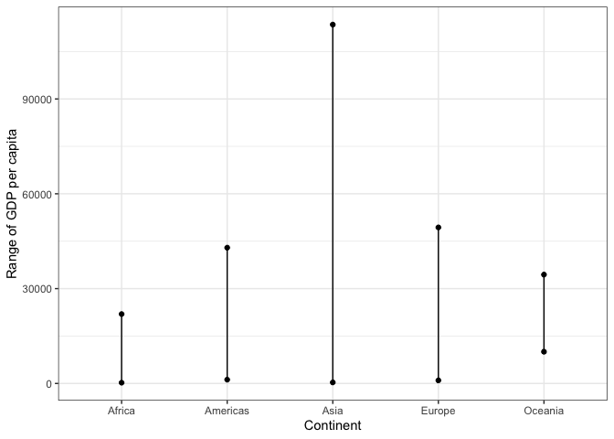
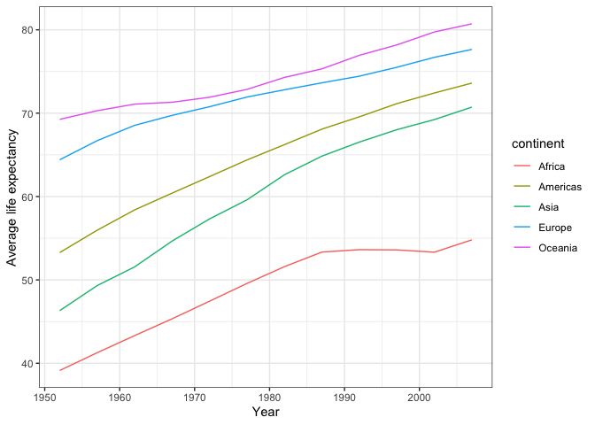
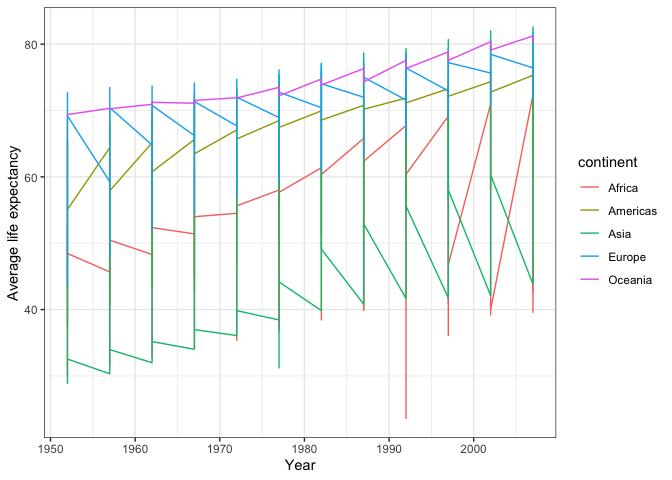
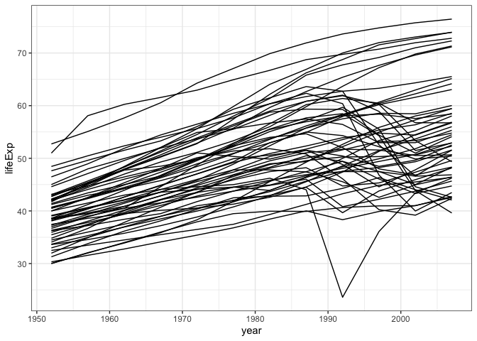
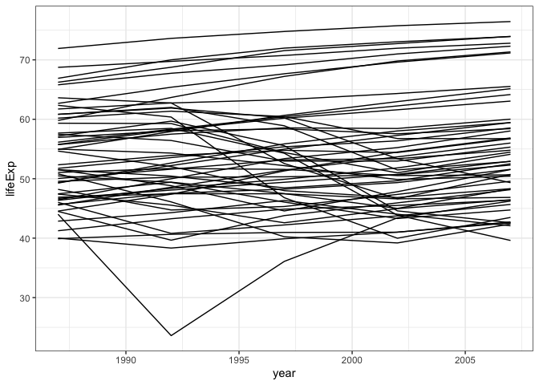
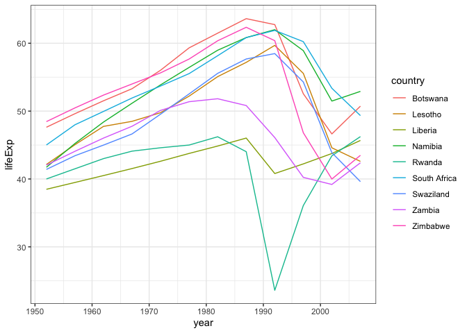

```r
suppressPackageStartupMessages(library(tidyverse))
suppressPackageStartupMessages(library(gapminder))
suppressPackageStartupMessages(library(data.table))
suppressPackageStartupMessages(library(ggthemes))
suppressPackageStartupMessages(library(DT))
```

# Instructions

Pick three of the six tasks below, and produce:

* a tibble, using dplyr as your data manipulation tool;
* an accompanying plot of data from the tibble, using ggplot2 as your visualization tool; and
* some dialogue about what your tables/figures show (doesn’t have to be much).

## _Task Option 2_
### Get the maximum and minimum of GDP per capita for all continents.

```r
gapminder %>%
  group_by(continent) %>% 
  summarize(minGDP=min(gdpPercap), maxGDP=max(gdpPercap)) %>% 
  datatable
```

<!--html_preserve--><div id="htmlwidget-5ee1a58094a7ebe3091c" style="width:100%;height:auto;" class="datatables html-widget"></div>
<script type="application/json" data-for="htmlwidget-5ee1a58094a7ebe3091c">{"x":{"filter":"none","data":[["1","2","3","4","5"],["Africa","Americas","Asia","Europe","Oceania"],[241.1658765,1201.637154,331,973.5331948,10039.59564],[21951.21176,42951.65309,113523.1329,49357.19017,34435.36744]],"container":"<table class=\"display\">\n  <thead>\n    <tr>\n      <th> <\/th>\n      <th>continent<\/th>\n      <th>minGDP<\/th>\n      <th>maxGDP<\/th>\n    <\/tr>\n  <\/thead>\n<\/table>","options":{"columnDefs":[{"className":"dt-right","targets":[2,3]},{"orderable":false,"targets":0}],"order":[],"autoWidth":false,"orderClasses":false}},"evals":[],"jsHooks":[]}</script><!--/html_preserve-->
Wait, let's reshape that data to make it easier to graph:

```r
library(data.table)
```

```r
wide<-gapminder %>%
  group_by(continent) %>% 
  summarize(minGDP=min(gdpPercap), maxGDP=max(gdpPercap))

long <- melt(wide, id.vars="continent", variable.names="year")
```

I chose to do a very simple stripchart to show the differences in ranges of GDP per capita between the continents

```r
long %>% 
  ggplot(aes(x=continent, y=value))+
    geom_point()+
    geom_line()+
    labs(x="Continent", y="Range of GDP per capita")+
    theme_bw()
```

<!-- -->


## _Task Option 5_
### How is life expectancy changing over time on different continents?

Here I have created a new column with average life expenctancy for each continent in each year.

```r
gapminder %>% 
  group_by(continent, year) %>% 
  mutate(avglife = mean(lifeExp)) %>% 
  distinct(continent, year, avglife) %>% 
  datatable()
```

<!--html_preserve--><div id="htmlwidget-969f9eb3bfd121960644" style="width:100%;height:auto;" class="datatables html-widget"></div>
<script type="application/json" data-for="htmlwidget-969f9eb3bfd121960644">{"x":{"filter":"none","data":[["1","2","3","4","5","6","7","8","9","10","11","12","13","14","15","16","17","18","19","20","21","22","23","24","25","26","27","28","29","30","31","32","33","34","35","36","37","38","39","40","41","42","43","44","45","46","47","48","49","50","51","52","53","54","55","56","57","58","59","60"],["Asia","Asia","Asia","Asia","Asia","Asia","Asia","Asia","Asia","Asia","Asia","Asia","Europe","Europe","Europe","Europe","Europe","Europe","Europe","Europe","Europe","Europe","Europe","Europe","Africa","Africa","Africa","Africa","Africa","Africa","Africa","Africa","Africa","Africa","Africa","Africa","Americas","Americas","Americas","Americas","Americas","Americas","Americas","Americas","Americas","Americas","Americas","Americas","Oceania","Oceania","Oceania","Oceania","Oceania","Oceania","Oceania","Oceania","Oceania","Oceania","Oceania","Oceania"],[1952,1957,1962,1967,1972,1977,1982,1987,1992,1997,2002,2007,1952,1957,1962,1967,1972,1977,1982,1987,1992,1997,2002,2007,1952,1957,1962,1967,1972,1977,1982,1987,1992,1997,2002,2007,1952,1957,1962,1967,1972,1977,1982,1987,1992,1997,2002,2007,1952,1957,1962,1967,1972,1977,1982,1987,1992,1997,2002,2007],[46.3143939393939,49.3185442424242,51.563223030303,54.66364,57.3192690909091,59.6105563636364,62.6179393939394,64.8511818181818,66.5372121212121,68.0205151515152,69.2338787878788,70.7284848484849,64.4085,66.7030666666667,68.5392333333333,69.7376,70.7750333333333,71.9377666666667,72.8064,73.6421666666667,74.4401,75.5051666666667,76.7006,77.6486,39.1355,41.2663461538462,43.3194423076923,45.3345384615385,47.4509423076923,49.5804230769231,51.5928653846154,53.3447884615385,53.6295769230769,53.5982692307692,53.3252307692308,54.8060384615385,53.27984,55.96028,58.39876,60.41092,62.39492,64.39156,66.22884,68.09072,69.56836,71.15048,72.42204,73.60812,69.255,70.295,71.085,71.31,71.91,72.855,74.29,75.32,76.945,78.19,79.74,80.7195]],"container":"<table class=\"display\">\n  <thead>\n    <tr>\n      <th> <\/th>\n      <th>continent<\/th>\n      <th>year<\/th>\n      <th>avglife<\/th>\n    <\/tr>\n  <\/thead>\n<\/table>","options":{"columnDefs":[{"className":"dt-right","targets":[2,3]},{"orderable":false,"targets":0}],"order":[],"autoWidth":false,"orderClasses":false}},"evals":[],"jsHooks":[]}</script><!--/html_preserve-->
I guess instead of making a new column and filtering out unique observations, we can use the summarize function:

```r
gapminder %>% 
  group_by(continent, year) %>% 
  summarize(avglife = mean(lifeExp)) %>% 
  datatable()
```

<!--html_preserve--><div id="htmlwidget-9c41d0e3c9557254a3ca" style="width:100%;height:auto;" class="datatables html-widget"></div>
<script type="application/json" data-for="htmlwidget-9c41d0e3c9557254a3ca">{"x":{"filter":"none","data":[["1","2","3","4","5","6","7","8","9","10","11","12","13","14","15","16","17","18","19","20","21","22","23","24","25","26","27","28","29","30","31","32","33","34","35","36","37","38","39","40","41","42","43","44","45","46","47","48","49","50","51","52","53","54","55","56","57","58","59","60"],["Africa","Africa","Africa","Africa","Africa","Africa","Africa","Africa","Africa","Africa","Africa","Africa","Americas","Americas","Americas","Americas","Americas","Americas","Americas","Americas","Americas","Americas","Americas","Americas","Asia","Asia","Asia","Asia","Asia","Asia","Asia","Asia","Asia","Asia","Asia","Asia","Europe","Europe","Europe","Europe","Europe","Europe","Europe","Europe","Europe","Europe","Europe","Europe","Oceania","Oceania","Oceania","Oceania","Oceania","Oceania","Oceania","Oceania","Oceania","Oceania","Oceania","Oceania"],[1952,1957,1962,1967,1972,1977,1982,1987,1992,1997,2002,2007,1952,1957,1962,1967,1972,1977,1982,1987,1992,1997,2002,2007,1952,1957,1962,1967,1972,1977,1982,1987,1992,1997,2002,2007,1952,1957,1962,1967,1972,1977,1982,1987,1992,1997,2002,2007,1952,1957,1962,1967,1972,1977,1982,1987,1992,1997,2002,2007],[39.1355,41.2663461538462,43.3194423076923,45.3345384615385,47.4509423076923,49.5804230769231,51.5928653846154,53.3447884615385,53.6295769230769,53.5982692307692,53.3252307692308,54.8060384615385,53.27984,55.96028,58.39876,60.41092,62.39492,64.39156,66.22884,68.09072,69.56836,71.15048,72.42204,73.60812,46.3143939393939,49.3185442424242,51.563223030303,54.66364,57.3192690909091,59.6105563636364,62.6179393939394,64.8511818181818,66.5372121212121,68.0205151515152,69.2338787878788,70.7284848484849,64.4085,66.7030666666667,68.5392333333333,69.7376,70.7750333333333,71.9377666666667,72.8064,73.6421666666667,74.4401,75.5051666666667,76.7006,77.6486,69.255,70.295,71.085,71.31,71.91,72.855,74.29,75.32,76.945,78.19,79.74,80.7195]],"container":"<table class=\"display\">\n  <thead>\n    <tr>\n      <th> <\/th>\n      <th>continent<\/th>\n      <th>year<\/th>\n      <th>avglife<\/th>\n    <\/tr>\n  <\/thead>\n<\/table>","options":{"columnDefs":[{"className":"dt-right","targets":[2,3]},{"orderable":false,"targets":0}],"order":[],"autoWidth":false,"orderClasses":false}},"evals":[],"jsHooks":[]}</script><!--/html_preserve-->


```r
gapminder %>% 
  group_by(continent, year) %>% 
  summarize(avglife = mean(lifeExp)) %>% 
  ggplot(aes(x=year, y=avglife, color=continent))+
    geom_line()+
    labs(x="Year", y="Average life expectancy")+
    theme_bw()
```

<!-- -->

I tried graphing this without the summarize function but couldn't get it to work:

```r
gapminder %>% 
  ggplot(aes(x=year, y=lifeExp, color=continent))+
    geom_line(aes(group=continent))+
    labs(x="Year", y="Average life expectancy")+
    theme_bw()
```

<!-- -->

I feel like this should work...


## _Task Option 6_
### Find countries with interesting stories. Open-ended and, therefore, hard. Promising but unsuccessful attempts are encouraged. This will generate interesting questions to follow up on in class.

Since we've been working with gapminder, I've noticed a huge drop in life expectancy in african countries in the early nineties. I'd like to look at that more clearly. First let's look at the countries in Africa:

```r
gapminder %>% 
  filter(continent == "Africa") %>% 
  ggplot(aes(x=year, y=lifeExp))+
    geom_line(aes(group=country))+
    theme_bw()
```

<!-- -->

Let's zoom in on the 90s

```r
gapminder %>% 
  filter(continent == "Africa") %>% 
  filter(year>1985) %>% 
  ggplot(aes(x=year, y=lifeExp))+
    geom_line(aes(group=country))+
    theme_bw()
```

<!-- -->

Looks like there's a few that have more "significant" drops than others. Let's tease out just the countries that have a "big" drop at some point

```r
gapminder %>% 
  filter(continent == "Africa") %>% 
  mutate(lifeExp_inc = lifeExp - lag(lifeExp)) %>% 
  filter(lifeExp_inc < -5, year !=1952) %>% 
  datatable()
```

<!--html_preserve--><div id="htmlwidget-429c3ddc2395f688f4c3" style="width:100%;height:auto;" class="datatables html-widget"></div>
<script type="application/json" data-for="htmlwidget-429c3ddc2395f688f4c3">{"x":{"filter":"none","data":[["1","2","3","4","5","6","7","8","9","10","11"],["Botswana","Botswana","Lesotho","Liberia","Namibia","Rwanda","South Africa","Swaziland","Zambia","Zimbabwe","Zimbabwe"],["Africa","Africa","Africa","Africa","Africa","Africa","Africa","Africa","Africa","Africa","Africa"],[1997,2002,2002,1992,2002,1992,2002,2002,1997,1997,2002],[52.556,46.634,44.593,40.802,51.479,23.599,53.365,43.869,40.238,46.809,39.989],[1536536,1630347,2046772,1912974,1972153,7290203,44433622,1130269,9417789,11404948,11926563],[8647.142313,11003.60508,1275.184575,636.6229191,4072.324751,737.0685949,7710.946444,4128.116943,1071.353818,792.4499603,672.0386227],[-10.189,-5.922,-10.965,-5.225,-7.43,-20.421,-6.871,-10.42,-5.862,-13.568,-6.82]],"container":"<table class=\"display\">\n  <thead>\n    <tr>\n      <th> <\/th>\n      <th>country<\/th>\n      <th>continent<\/th>\n      <th>year<\/th>\n      <th>lifeExp<\/th>\n      <th>pop<\/th>\n      <th>gdpPercap<\/th>\n      <th>lifeExp_inc<\/th>\n    <\/tr>\n  <\/thead>\n<\/table>","options":{"columnDefs":[{"className":"dt-right","targets":[3,4,5,6,7]},{"orderable":false,"targets":0}],"order":[],"autoWidth":false,"orderClasses":false}},"evals":[],"jsHooks":[]}</script><!--/html_preserve-->

Now let's plot just those countries. I'm sure there's a more elegant way to do this, but for now I'll stick to what I know :)

```r
gapminder %>% 
  filter(country=="Botswana"|country=="Lesotho"|country=="Liberia"|country=="Namibia"|country=="Rwanda"|country=="South Africa"|country=="Swaziland"|country=="Zambia"|country=="Zimbabwe") %>% 
  ggplot(aes(x=year, y=lifeExp, color=country))+
    geom_line(aes(group=country))+
    theme_bw()
```

<!-- -->

So what happened to these countries from the late 80s to now? All except Liberia are located in the southern half of Africa. I'm guessing it was the HIV/AIDS epidemic. 

I would love to make a graph with the lines for all the countries in the world in black except for these 9 countries in the colors shown above. I couldn't figure it out though

Here's a table to go along with it. It shows the change in life expectancy from year to year in order to highlight the big drops:

```r
gapminder %>% 
  filter(country=="Botswana"|country=="Lesotho"|country=="Liberia"|country=="Namibia"|country=="Rwanda"|country=="South Africa"|country=="Swaziland"|country=="Zambia"|country=="Zimbabwe") %>% 
  mutate(lifeExp_inc = lifeExp - lag(lifeExp)) %>% 
  select(country,year,lifeExp, lifeExp_inc) %>% 
  datatable()
```

<!--html_preserve--><div id="htmlwidget-1dbedba03f53943a1ebd" style="width:100%;height:auto;" class="datatables html-widget"></div>
<script type="application/json" data-for="htmlwidget-1dbedba03f53943a1ebd">{"x":{"filter":"none","data":[["1","2","3","4","5","6","7","8","9","10","11","12","13","14","15","16","17","18","19","20","21","22","23","24","25","26","27","28","29","30","31","32","33","34","35","36","37","38","39","40","41","42","43","44","45","46","47","48","49","50","51","52","53","54","55","56","57","58","59","60","61","62","63","64","65","66","67","68","69","70","71","72","73","74","75","76","77","78","79","80","81","82","83","84","85","86","87","88","89","90","91","92","93","94","95","96","97","98","99","100","101","102","103","104","105","106","107","108"],["Botswana","Botswana","Botswana","Botswana","Botswana","Botswana","Botswana","Botswana","Botswana","Botswana","Botswana","Botswana","Lesotho","Lesotho","Lesotho","Lesotho","Lesotho","Lesotho","Lesotho","Lesotho","Lesotho","Lesotho","Lesotho","Lesotho","Liberia","Liberia","Liberia","Liberia","Liberia","Liberia","Liberia","Liberia","Liberia","Liberia","Liberia","Liberia","Namibia","Namibia","Namibia","Namibia","Namibia","Namibia","Namibia","Namibia","Namibia","Namibia","Namibia","Namibia","Rwanda","Rwanda","Rwanda","Rwanda","Rwanda","Rwanda","Rwanda","Rwanda","Rwanda","Rwanda","Rwanda","Rwanda","South Africa","South Africa","South Africa","South Africa","South Africa","South Africa","South Africa","South Africa","South Africa","South Africa","South Africa","South Africa","Swaziland","Swaziland","Swaziland","Swaziland","Swaziland","Swaziland","Swaziland","Swaziland","Swaziland","Swaziland","Swaziland","Swaziland","Zambia","Zambia","Zambia","Zambia","Zambia","Zambia","Zambia","Zambia","Zambia","Zambia","Zambia","Zambia","Zimbabwe","Zimbabwe","Zimbabwe","Zimbabwe","Zimbabwe","Zimbabwe","Zimbabwe","Zimbabwe","Zimbabwe","Zimbabwe","Zimbabwe","Zimbabwe"],[1952,1957,1962,1967,1972,1977,1982,1987,1992,1997,2002,2007,1952,1957,1962,1967,1972,1977,1982,1987,1992,1997,2002,2007,1952,1957,1962,1967,1972,1977,1982,1987,1992,1997,2002,2007,1952,1957,1962,1967,1972,1977,1982,1987,1992,1997,2002,2007,1952,1957,1962,1967,1972,1977,1982,1987,1992,1997,2002,2007,1952,1957,1962,1967,1972,1977,1982,1987,1992,1997,2002,2007,1952,1957,1962,1967,1972,1977,1982,1987,1992,1997,2002,2007,1952,1957,1962,1967,1972,1977,1982,1987,1992,1997,2002,2007,1952,1957,1962,1967,1972,1977,1982,1987,1992,1997,2002,2007],[47.622,49.618,51.52,53.298,56.024,59.319,61.484,63.622,62.745,52.556,46.634,50.728,42.138,45.047,47.747,48.492,49.767,52.208,55.078,57.18,59.685,55.558,44.593,42.592,38.48,39.486,40.502,41.536,42.614,43.764,44.852,46.027,40.802,42.221,43.753,45.678,41.725,45.226,48.386,51.159,53.867,56.437,58.968,60.835,61.999,58.909,51.479,52.906,40,41.5,43,44.1,44.6,45,46.218,44.02,23.599,36.087,43.413,46.242,45.009,47.985,49.951,51.927,53.696,55.527,58.161,60.834,61.888,60.236,53.365,49.339,41.407,43.424,44.992,46.633,49.552,52.537,55.561,57.678,58.474,54.289,43.869,39.613,42.038,44.077,46.023,47.768,50.107,51.386,51.821,50.821,46.1,40.238,39.193,42.384,48.451,50.469,52.358,53.995,55.635,57.674,60.363,62.351,60.377,46.809,39.989,43.487],[null,1.996,1.902,1.778,2.726,3.295,2.165,2.138,-0.877000000000002,-10.189,-5.922,4.094,-8.59,2.909,2.7,0.744999999999997,1.27500000000001,2.441,2.87,2.102,2.505,-4.127,-10.965,-2.001,-4.112,1.006,1.01600000000001,1.034,1.078,1.15000000000001,1.08799999999999,1.175,-5.225,1.419,1.532,1.925,-3.953,3.501,3.16,2.773,2.708,2.57,2.53100000000001,1.867,1.164,-3.09,-7.43,1.427,-12.906,1.5,1.5,1.1,0.5,0.399999999999999,1.218,-2.198,-20.421,12.488,7.32599999999999,2.829,-1.233,2.976,1.966,1.976,1.769,1.831,2.634,2.673,1.05399999999999,-1.652,-6.871,-4.026,-7.932,2.017,1.568,1.64100000000001,2.919,2.985,3.024,2.117,0.795999999999999,-4.185,-10.42,-4.256,2.425,2.039,1.94600000000001,1.745,2.339,1.279,0.434999999999995,-1,-4.721,-5.862,-1.045,3.191,6.067,2.018,1.889,1.637,1.64,2.039,2.689,1.988,-1.974,-13.568,-6.82,3.498]],"container":"<table class=\"display\">\n  <thead>\n    <tr>\n      <th> <\/th>\n      <th>country<\/th>\n      <th>year<\/th>\n      <th>lifeExp<\/th>\n      <th>lifeExp_inc<\/th>\n    <\/tr>\n  <\/thead>\n<\/table>","options":{"columnDefs":[{"className":"dt-right","targets":[2,3,4]},{"orderable":false,"targets":0}],"order":[],"autoWidth":false,"orderClasses":false}},"evals":[],"jsHooks":[]}</script><!--/html_preserve-->

