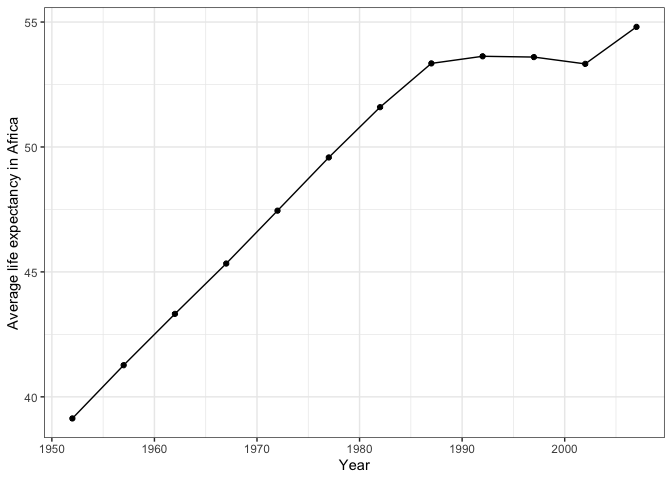

```r
suppressPackageStartupMessages(library(tidyverse))
suppressPackageStartupMessages(library(gapminder))
suppressPackageStartupMessages(library(DT))
```

#Exercise 1: Univariate Data Reshaping
You are expected to use pivot_wider() and pivot_longer() for reshaping, and ggplot2 for the plot.

## **Univariate Option 1**
_First let's remind ourselves of the structure of the gapminder dataset_

```r
head(gapminder)
```

```
## # A tibble: 6 x 6
##   country     continent  year lifeExp      pop gdpPercap
##   <fct>       <fct>     <int>   <dbl>    <int>     <dbl>
## 1 Afghanistan Asia       1952    28.8  8425333      779.
## 2 Afghanistan Asia       1957    30.3  9240934      821.
## 3 Afghanistan Asia       1962    32.0 10267083      853.
## 4 Afghanistan Asia       1967    34.0 11537966      836.
## 5 Afghanistan Asia       1972    36.1 13079460      740.
## 6 Afghanistan Asia       1977    38.4 14880372      786.
```

### 1. Make a tibble with one row per year, and columns for life expectancy for two or more countries.

_Okay, so first I'm going to select columns country, year, and life expectancy. Then I'll filter the rows to one country of my choice from each continent. This will be the tibble I pipe into pivot_wider()_


```r
long <- gapminder %>%
  select(country, year, lifeExp) %>% 
  filter(country %in% c("Germany", "Rwanda", "Japan", "Bolivia", "New Zealand"))

long %>% datatable()
```

<!--html_preserve--><div id="htmlwidget-3611372d423bc936b86a" style="width:100%;height:auto;" class="datatables html-widget"></div>
<script type="application/json" data-for="htmlwidget-3611372d423bc936b86a">{"x":{"filter":"none","data":[["1","2","3","4","5","6","7","8","9","10","11","12","13","14","15","16","17","18","19","20","21","22","23","24","25","26","27","28","29","30","31","32","33","34","35","36","37","38","39","40","41","42","43","44","45","46","47","48","49","50","51","52","53","54","55","56","57","58","59","60"],["Bolivia","Bolivia","Bolivia","Bolivia","Bolivia","Bolivia","Bolivia","Bolivia","Bolivia","Bolivia","Bolivia","Bolivia","Germany","Germany","Germany","Germany","Germany","Germany","Germany","Germany","Germany","Germany","Germany","Germany","Japan","Japan","Japan","Japan","Japan","Japan","Japan","Japan","Japan","Japan","Japan","Japan","New Zealand","New Zealand","New Zealand","New Zealand","New Zealand","New Zealand","New Zealand","New Zealand","New Zealand","New Zealand","New Zealand","New Zealand","Rwanda","Rwanda","Rwanda","Rwanda","Rwanda","Rwanda","Rwanda","Rwanda","Rwanda","Rwanda","Rwanda","Rwanda"],[1952,1957,1962,1967,1972,1977,1982,1987,1992,1997,2002,2007,1952,1957,1962,1967,1972,1977,1982,1987,1992,1997,2002,2007,1952,1957,1962,1967,1972,1977,1982,1987,1992,1997,2002,2007,1952,1957,1962,1967,1972,1977,1982,1987,1992,1997,2002,2007,1952,1957,1962,1967,1972,1977,1982,1987,1992,1997,2002,2007],[40.414,41.89,43.428,45.032,46.714,50.023,53.859,57.251,59.957,62.05,63.883,65.554,67.5,69.1,70.3,70.8,71,72.5,73.8,74.847,76.07,77.34,78.67,79.406,63.03,65.5,68.73,71.43,73.42,75.38,77.11,78.67,79.36,80.69,82,82.603,69.39,70.26,71.24,71.52,71.89,72.22,73.84,74.32,76.33,77.55,79.11,80.204,40,41.5,43,44.1,44.6,45,46.218,44.02,23.599,36.087,43.413,46.242]],"container":"<table class=\"display\">\n  <thead>\n    <tr>\n      <th> <\/th>\n      <th>country<\/th>\n      <th>year<\/th>\n      <th>lifeExp<\/th>\n    <\/tr>\n  <\/thead>\n<\/table>","options":{"columnDefs":[{"className":"dt-right","targets":[2,3]},{"orderable":false,"targets":0}],"order":[],"autoWidth":false,"orderClasses":false}},"evals":[],"jsHooks":[]}</script><!--/html_preserve-->

_Now we can widen my "long" tibble_

```r
wide <- long %>% 
  pivot_wider(id_cols = year,
              names_from = country,
              values_from = lifeExp)

wide %>% datatable()
```

<!--html_preserve--><div id="htmlwidget-0b3df7e3a1f144bdb3c7" style="width:100%;height:auto;" class="datatables html-widget"></div>
<script type="application/json" data-for="htmlwidget-0b3df7e3a1f144bdb3c7">{"x":{"filter":"none","data":[["1","2","3","4","5","6","7","8","9","10","11","12"],[1952,1957,1962,1967,1972,1977,1982,1987,1992,1997,2002,2007],[40.414,41.89,43.428,45.032,46.714,50.023,53.859,57.251,59.957,62.05,63.883,65.554],[67.5,69.1,70.3,70.8,71,72.5,73.8,74.847,76.07,77.34,78.67,79.406],[63.03,65.5,68.73,71.43,73.42,75.38,77.11,78.67,79.36,80.69,82,82.603],[69.39,70.26,71.24,71.52,71.89,72.22,73.84,74.32,76.33,77.55,79.11,80.204],[40,41.5,43,44.1,44.6,45,46.218,44.02,23.599,36.087,43.413,46.242]],"container":"<table class=\"display\">\n  <thead>\n    <tr>\n      <th> <\/th>\n      <th>year<\/th>\n      <th>Bolivia<\/th>\n      <th>Germany<\/th>\n      <th>Japan<\/th>\n      <th>New Zealand<\/th>\n      <th>Rwanda<\/th>\n    <\/tr>\n  <\/thead>\n<\/table>","options":{"columnDefs":[{"className":"dt-right","targets":[1,2,3,4,5,6]},{"orderable":false,"targets":0}],"order":[],"autoWidth":false,"orderClasses":false}},"evals":[],"jsHooks":[]}</script><!--/html_preserve-->

### 2. Take advantage of this new data shape to scatterplot life expectancy for one country against that of another.

_Graphing the life expectancies of two countries against each other in this way allows us to compare their relative patterns over time. For example, We can see that Japan and Germany have both had steady increases in life expectancy over time which creates a positive linear relationship. Whereas, Germany and Rwanda have had quite different trajectories in life expectancy as there seems to be no linear relationship._

```r
wide %>% 
  ggplot(aes(x=Japan, y=Germany))+
    geom_point()+
    theme_bw()+
    labs(x="Japan life expectancy", y="Germany life expectancy")
```

<!-- -->

```r
wide %>% 
  ggplot(aes(x=Rwanda, y=Germany))+
    geom_point()+
    theme_bw()+
    labs(x="Rwanda life expectancy", y="Germany life expectancy")
```

<!-- -->

### 3. Re-lengthen the data

```r
wide_to_long <- wide %>% 
  pivot_longer(cols = -year,
               names_to = "country",
               values_to = "lifeExp")

wide_to_long %>% datatable()
```

<!--html_preserve--><div id="htmlwidget-87261439fc62694e1e60" style="width:100%;height:auto;" class="datatables html-widget"></div>
<script type="application/json" data-for="htmlwidget-87261439fc62694e1e60">{"x":{"filter":"none","data":[["1","2","3","4","5","6","7","8","9","10","11","12","13","14","15","16","17","18","19","20","21","22","23","24","25","26","27","28","29","30","31","32","33","34","35","36","37","38","39","40","41","42","43","44","45","46","47","48","49","50","51","52","53","54","55","56","57","58","59","60"],[1952,1952,1952,1952,1952,1957,1957,1957,1957,1957,1962,1962,1962,1962,1962,1967,1967,1967,1967,1967,1972,1972,1972,1972,1972,1977,1977,1977,1977,1977,1982,1982,1982,1982,1982,1987,1987,1987,1987,1987,1992,1992,1992,1992,1992,1997,1997,1997,1997,1997,2002,2002,2002,2002,2002,2007,2007,2007,2007,2007],["Bolivia","Germany","Japan","New Zealand","Rwanda","Bolivia","Germany","Japan","New Zealand","Rwanda","Bolivia","Germany","Japan","New Zealand","Rwanda","Bolivia","Germany","Japan","New Zealand","Rwanda","Bolivia","Germany","Japan","New Zealand","Rwanda","Bolivia","Germany","Japan","New Zealand","Rwanda","Bolivia","Germany","Japan","New Zealand","Rwanda","Bolivia","Germany","Japan","New Zealand","Rwanda","Bolivia","Germany","Japan","New Zealand","Rwanda","Bolivia","Germany","Japan","New Zealand","Rwanda","Bolivia","Germany","Japan","New Zealand","Rwanda","Bolivia","Germany","Japan","New Zealand","Rwanda"],[40.414,67.5,63.03,69.39,40,41.89,69.1,65.5,70.26,41.5,43.428,70.3,68.73,71.24,43,45.032,70.8,71.43,71.52,44.1,46.714,71,73.42,71.89,44.6,50.023,72.5,75.38,72.22,45,53.859,73.8,77.11,73.84,46.218,57.251,74.847,78.67,74.32,44.02,59.957,76.07,79.36,76.33,23.599,62.05,77.34,80.69,77.55,36.087,63.883,78.67,82,79.11,43.413,65.554,79.406,82.603,80.204,46.242]],"container":"<table class=\"display\">\n  <thead>\n    <tr>\n      <th> <\/th>\n      <th>year<\/th>\n      <th>country<\/th>\n      <th>lifeExp<\/th>\n    <\/tr>\n  <\/thead>\n<\/table>","options":{"columnDefs":[{"className":"dt-right","targets":[1,3]},{"orderable":false,"targets":0}],"order":[],"autoWidth":false,"orderClasses":false}},"evals":[],"jsHooks":[]}</script><!--/html_preserve-->

## **Univariate Option 2**
_I have time, so I'm going to do this option as well for the practice._

### 1. Compute some measure of life expectancy (mean? median? min? max?) for all possible combinations of continent and year. Reshape that to have one row per year and one variable for each continent. Or the other way around: one row per continent and one variable per year.

_Again we'll look at the structure of gapminder_

```r
head(gapminder)
```

```
## # A tibble: 6 x 6
##   country     continent  year lifeExp      pop gdpPercap
##   <fct>       <fct>     <int>   <dbl>    <int>     <dbl>
## 1 Afghanistan Asia       1952    28.8  8425333      779.
## 2 Afghanistan Asia       1957    30.3  9240934      821.
## 3 Afghanistan Asia       1962    32.0 10267083      853.
## 4 Afghanistan Asia       1967    34.0 11537966      836.
## 5 Afghanistan Asia       1972    36.1 13079460      740.
## 6 Afghanistan Asia       1977    38.4 14880372      786.
```

_And now I'm making a new column for the mean life expectancy in each continent in each year._

```r
long2 <- gapminder %>%
  group_by(continent, year) %>% 
  summarise(avg_life = mean(lifeExp))

long2 %>% datatable()
```

<!--html_preserve--><div id="htmlwidget-833384c1e9d1bc38f566" style="width:100%;height:auto;" class="datatables html-widget"></div>
<script type="application/json" data-for="htmlwidget-833384c1e9d1bc38f566">{"x":{"filter":"none","data":[["1","2","3","4","5","6","7","8","9","10","11","12","13","14","15","16","17","18","19","20","21","22","23","24","25","26","27","28","29","30","31","32","33","34","35","36","37","38","39","40","41","42","43","44","45","46","47","48","49","50","51","52","53","54","55","56","57","58","59","60"],["Africa","Africa","Africa","Africa","Africa","Africa","Africa","Africa","Africa","Africa","Africa","Africa","Americas","Americas","Americas","Americas","Americas","Americas","Americas","Americas","Americas","Americas","Americas","Americas","Asia","Asia","Asia","Asia","Asia","Asia","Asia","Asia","Asia","Asia","Asia","Asia","Europe","Europe","Europe","Europe","Europe","Europe","Europe","Europe","Europe","Europe","Europe","Europe","Oceania","Oceania","Oceania","Oceania","Oceania","Oceania","Oceania","Oceania","Oceania","Oceania","Oceania","Oceania"],[1952,1957,1962,1967,1972,1977,1982,1987,1992,1997,2002,2007,1952,1957,1962,1967,1972,1977,1982,1987,1992,1997,2002,2007,1952,1957,1962,1967,1972,1977,1982,1987,1992,1997,2002,2007,1952,1957,1962,1967,1972,1977,1982,1987,1992,1997,2002,2007,1952,1957,1962,1967,1972,1977,1982,1987,1992,1997,2002,2007],[39.1355,41.2663461538462,43.3194423076923,45.3345384615385,47.4509423076923,49.5804230769231,51.5928653846154,53.3447884615385,53.6295769230769,53.5982692307692,53.3252307692308,54.8060384615385,53.27984,55.96028,58.39876,60.41092,62.39492,64.39156,66.22884,68.09072,69.56836,71.15048,72.42204,73.60812,46.3143939393939,49.3185442424242,51.563223030303,54.66364,57.3192690909091,59.6105563636364,62.6179393939394,64.8511818181818,66.5372121212121,68.0205151515152,69.2338787878788,70.7284848484849,64.4085,66.7030666666667,68.5392333333333,69.7376,70.7750333333333,71.9377666666667,72.8064,73.6421666666667,74.4401,75.5051666666667,76.7006,77.6486,69.255,70.295,71.085,71.31,71.91,72.855,74.29,75.32,76.945,78.19,79.74,80.7195]],"container":"<table class=\"display\">\n  <thead>\n    <tr>\n      <th> <\/th>\n      <th>continent<\/th>\n      <th>year<\/th>\n      <th>avg_life<\/th>\n    <\/tr>\n  <\/thead>\n<\/table>","options":{"columnDefs":[{"className":"dt-right","targets":[2,3]},{"orderable":false,"targets":0}],"order":[],"autoWidth":false,"orderClasses":false}},"evals":[],"jsHooks":[]}</script><!--/html_preserve-->

_And now to widen the data by having a column for each continent's average life expectancy for every year._

```r
wide2 <- long2 %>% 
  pivot_wider(id_cols = year,
              names_from = continent,
              values_from = avg_life)

wide2 %>% datatable()
```

<!--html_preserve--><div id="htmlwidget-250b4c37e3132b7cd5e7" style="width:100%;height:auto;" class="datatables html-widget"></div>
<script type="application/json" data-for="htmlwidget-250b4c37e3132b7cd5e7">{"x":{"filter":"none","data":[["1","2","3","4","5","6","7","8","9","10","11","12"],[1952,1957,1962,1967,1972,1977,1982,1987,1992,1997,2002,2007],[39.1355,41.2663461538462,43.3194423076923,45.3345384615385,47.4509423076923,49.5804230769231,51.5928653846154,53.3447884615385,53.6295769230769,53.5982692307692,53.3252307692308,54.8060384615385],[53.27984,55.96028,58.39876,60.41092,62.39492,64.39156,66.22884,68.09072,69.56836,71.15048,72.42204,73.60812],[46.3143939393939,49.3185442424242,51.563223030303,54.66364,57.3192690909091,59.6105563636364,62.6179393939394,64.8511818181818,66.5372121212121,68.0205151515152,69.2338787878788,70.7284848484849],[64.4085,66.7030666666667,68.5392333333333,69.7376,70.7750333333333,71.9377666666667,72.8064,73.6421666666667,74.4401,75.5051666666667,76.7006,77.6486],[69.255,70.295,71.085,71.31,71.91,72.855,74.29,75.32,76.945,78.19,79.74,80.7195]],"container":"<table class=\"display\">\n  <thead>\n    <tr>\n      <th> <\/th>\n      <th>year<\/th>\n      <th>Africa<\/th>\n      <th>Americas<\/th>\n      <th>Asia<\/th>\n      <th>Europe<\/th>\n      <th>Oceania<\/th>\n    <\/tr>\n  <\/thead>\n<\/table>","options":{"columnDefs":[{"className":"dt-right","targets":[1,2,3,4,5,6]},{"orderable":false,"targets":0}],"order":[],"autoWidth":false,"orderClasses":false}},"evals":[],"jsHooks":[]}</script><!--/html_preserve-->

### 2. Is there a plot that is easier to make with the data in this shape versus the usual form? Try making such a plot!

_With the data in this format, we can do a very simple ggplot to view the life expectancy patterns without having to filter or wrangle the data at all._

```r
wide2 %>% 
  ggplot(aes(x=year, y=Africa))+
    geom_point()+
    geom_line()+
    theme_bw()+
    labs(x="Year", y="Average life expectancy in Africa")
```

<!-- -->

### 3. Re-lengthen the data.

```r
wide2_to_long2 <- wide2 %>% 
  pivot_longer(cols = -year,
               names_to = "continent",
               values_to = "avg_life")

wide2_to_long2 %>% datatable()
```

<!--html_preserve--><div id="htmlwidget-020d558be7218b3755e0" style="width:100%;height:auto;" class="datatables html-widget"></div>
<script type="application/json" data-for="htmlwidget-020d558be7218b3755e0">{"x":{"filter":"none","data":[["1","2","3","4","5","6","7","8","9","10","11","12","13","14","15","16","17","18","19","20","21","22","23","24","25","26","27","28","29","30","31","32","33","34","35","36","37","38","39","40","41","42","43","44","45","46","47","48","49","50","51","52","53","54","55","56","57","58","59","60"],[1952,1952,1952,1952,1952,1957,1957,1957,1957,1957,1962,1962,1962,1962,1962,1967,1967,1967,1967,1967,1972,1972,1972,1972,1972,1977,1977,1977,1977,1977,1982,1982,1982,1982,1982,1987,1987,1987,1987,1987,1992,1992,1992,1992,1992,1997,1997,1997,1997,1997,2002,2002,2002,2002,2002,2007,2007,2007,2007,2007],["Africa","Americas","Asia","Europe","Oceania","Africa","Americas","Asia","Europe","Oceania","Africa","Americas","Asia","Europe","Oceania","Africa","Americas","Asia","Europe","Oceania","Africa","Americas","Asia","Europe","Oceania","Africa","Americas","Asia","Europe","Oceania","Africa","Americas","Asia","Europe","Oceania","Africa","Americas","Asia","Europe","Oceania","Africa","Americas","Asia","Europe","Oceania","Africa","Americas","Asia","Europe","Oceania","Africa","Americas","Asia","Europe","Oceania","Africa","Americas","Asia","Europe","Oceania"],[39.1355,53.27984,46.3143939393939,64.4085,69.255,41.2663461538462,55.96028,49.3185442424242,66.7030666666667,70.295,43.3194423076923,58.39876,51.563223030303,68.5392333333333,71.085,45.3345384615385,60.41092,54.66364,69.7376,71.31,47.4509423076923,62.39492,57.3192690909091,70.7750333333333,71.91,49.5804230769231,64.39156,59.6105563636364,71.9377666666667,72.855,51.5928653846154,66.22884,62.6179393939394,72.8064,74.29,53.3447884615385,68.09072,64.8511818181818,73.6421666666667,75.32,53.6295769230769,69.56836,66.5372121212121,74.4401,76.945,53.5982692307692,71.15048,68.0205151515152,75.5051666666667,78.19,53.3252307692308,72.42204,69.2338787878788,76.7006,79.74,54.8060384615385,73.60812,70.7284848484849,77.6486,80.7195]],"container":"<table class=\"display\">\n  <thead>\n    <tr>\n      <th> <\/th>\n      <th>year<\/th>\n      <th>continent<\/th>\n      <th>avg_life<\/th>\n    <\/tr>\n  <\/thead>\n<\/table>","options":{"columnDefs":[{"className":"dt-right","targets":[1,3]},{"orderable":false,"targets":0}],"order":[],"autoWidth":false,"orderClasses":false}},"evals":[],"jsHooks":[]}</script><!--/html_preserve-->

#Exercise 2: Multivariate Data Reshaping

Don’t worry about producing a plot here. You are expected to use pivot_wider() and pivot_longer() for reshaping.

## **Multivariate Option 1**
### 1. Make a tibble with one row per year, and columns for life expectancy and GDP per capita (or two other numeric variables) for two or more countries.

_I would like to put the country before the other variable in the name, but I can't figure out how to do that._

```r
wide3 <- gapminder %>% 
  select(country, year, lifeExp, gdpPercap) %>% 
  filter(country %in% c("Vietnam", "Chad", "Serbia")) %>% 
  pivot_wider(id_cols = year,
              names_from = country,
              names_sep = "_",
              values_from = c(lifeExp, gdpPercap))

wide3 %>% datatable()
```

<!--html_preserve--><div id="htmlwidget-3a0c80cf672514c1c88a" style="width:100%;height:auto;" class="datatables html-widget"></div>
<script type="application/json" data-for="htmlwidget-3a0c80cf672514c1c88a">{"x":{"filter":"none","data":[["1","2","3","4","5","6","7","8","9","10","11","12"],[1952,1957,1962,1967,1972,1977,1982,1987,1992,1997,2002,2007],[38.092,39.881,41.716,43.601,45.569,47.383,49.517,51.051,51.724,51.573,50.525,50.651],[57.996,61.685,64.531,66.914,68.7,70.3,70.162,71.218,71.659,72.232,73.213,74.002],[40.412,42.887,45.363,47.838,50.254,55.764,58.816,62.82,67.662,70.672,73.017,74.249],[1178.665927,1308.495577,1389.817618,1196.810565,1104.103987,1133.98495,797.9081006,952.386129,1058.0643,1004.961353,1156.18186,1704.063724],[3581.459448,4981.090891,6289.629157,7991.707066,10522.06749,12980.66956,15181.0927,15870.87851,9325.068238,7914.320304,7236.075251,9786.534714],[605.0664917,676.2854478,772.0491602,637.1232887,699.5016441,713.5371196,707.2357863,820.7994449,989.0231487,1385.896769,1764.456677,2441.576404]],"container":"<table class=\"display\">\n  <thead>\n    <tr>\n      <th> <\/th>\n      <th>year<\/th>\n      <th>lifeExp_Chad<\/th>\n      <th>lifeExp_Serbia<\/th>\n      <th>lifeExp_Vietnam<\/th>\n      <th>gdpPercap_Chad<\/th>\n      <th>gdpPercap_Serbia<\/th>\n      <th>gdpPercap_Vietnam<\/th>\n    <\/tr>\n  <\/thead>\n<\/table>","options":{"columnDefs":[{"className":"dt-right","targets":[1,2,3,4,5,6,7]},{"orderable":false,"targets":0}],"order":[],"autoWidth":false,"orderClasses":false}},"evals":[],"jsHooks":[]}</script><!--/html_preserve-->

### 2. Re-lengthen the data.

```r
wide3_to_long3 <- wide3 %>%
  pivot_longer(cols = -year,
               names_to = c(".value", "country"),
               names_sep = "_")

wide3_to_long3 %>% datatable()
```

<!--html_preserve--><div id="htmlwidget-7963594c334827b79a6e" style="width:100%;height:auto;" class="datatables html-widget"></div>
<script type="application/json" data-for="htmlwidget-7963594c334827b79a6e">{"x":{"filter":"none","data":[["1","2","3","4","5","6","7","8","9","10","11","12","13","14","15","16","17","18","19","20","21","22","23","24","25","26","27","28","29","30","31","32","33","34","35","36"],[1952,1952,1952,1957,1957,1957,1962,1962,1962,1967,1967,1967,1972,1972,1972,1977,1977,1977,1982,1982,1982,1987,1987,1987,1992,1992,1992,1997,1997,1997,2002,2002,2002,2007,2007,2007],["Chad","Serbia","Vietnam","Chad","Serbia","Vietnam","Chad","Serbia","Vietnam","Chad","Serbia","Vietnam","Chad","Serbia","Vietnam","Chad","Serbia","Vietnam","Chad","Serbia","Vietnam","Chad","Serbia","Vietnam","Chad","Serbia","Vietnam","Chad","Serbia","Vietnam","Chad","Serbia","Vietnam","Chad","Serbia","Vietnam"],[38.092,57.996,40.412,39.881,61.685,42.887,41.716,64.531,45.363,43.601,66.914,47.838,45.569,68.7,50.254,47.383,70.3,55.764,49.517,70.162,58.816,51.051,71.218,62.82,51.724,71.659,67.662,51.573,72.232,70.672,50.525,73.213,73.017,50.651,74.002,74.249],[1178.665927,3581.459448,605.0664917,1308.495577,4981.090891,676.2854478,1389.817618,6289.629157,772.0491602,1196.810565,7991.707066,637.1232887,1104.103987,10522.06749,699.5016441,1133.98495,12980.66956,713.5371196,797.9081006,15181.0927,707.2357863,952.386129,15870.87851,820.7994449,1058.0643,9325.068238,989.0231487,1004.961353,7914.320304,1385.896769,1156.18186,7236.075251,1764.456677,1704.063724,9786.534714,2441.576404]],"container":"<table class=\"display\">\n  <thead>\n    <tr>\n      <th> <\/th>\n      <th>year<\/th>\n      <th>country<\/th>\n      <th>lifeExp<\/th>\n      <th>gdpPercap<\/th>\n    <\/tr>\n  <\/thead>\n<\/table>","options":{"columnDefs":[{"className":"dt-right","targets":[1,3,4]},{"orderable":false,"targets":0}],"order":[],"autoWidth":false,"orderClasses":false}},"evals":[],"jsHooks":[]}</script><!--/html_preserve-->

## **Multivariate Option 2**
_Again, I have time so I'm going to do this for practice._

### 1. Compute some measure of life expectancy and GDP per capita (or two other numeric variables) (mean? median? min? max?) for all possible combinations of continent and year. Reshape that to have one row per year and one variable for each continent-measurement combination. Or the other way around: one row per continent and one variable for each year-measurement combination.

_I'm adding columns for the average life expecatncy and average GDP per capita for every continent in every year._

```r
long4 <- gapminder %>% 
  group_by(continent, year) %>% 
  summarise(avgLife = mean(lifeExp), avgGDP = mean(gdpPercap))

long4 %>% datatable()
```

<!--html_preserve--><div id="htmlwidget-8e655bc64f786a6199fb" style="width:100%;height:auto;" class="datatables html-widget"></div>
<script type="application/json" data-for="htmlwidget-8e655bc64f786a6199fb">{"x":{"filter":"none","data":[["1","2","3","4","5","6","7","8","9","10","11","12","13","14","15","16","17","18","19","20","21","22","23","24","25","26","27","28","29","30","31","32","33","34","35","36","37","38","39","40","41","42","43","44","45","46","47","48","49","50","51","52","53","54","55","56","57","58","59","60"],["Africa","Africa","Africa","Africa","Africa","Africa","Africa","Africa","Africa","Africa","Africa","Africa","Americas","Americas","Americas","Americas","Americas","Americas","Americas","Americas","Americas","Americas","Americas","Americas","Asia","Asia","Asia","Asia","Asia","Asia","Asia","Asia","Asia","Asia","Asia","Asia","Europe","Europe","Europe","Europe","Europe","Europe","Europe","Europe","Europe","Europe","Europe","Europe","Oceania","Oceania","Oceania","Oceania","Oceania","Oceania","Oceania","Oceania","Oceania","Oceania","Oceania","Oceania"],[1952,1957,1962,1967,1972,1977,1982,1987,1992,1997,2002,2007,1952,1957,1962,1967,1972,1977,1982,1987,1992,1997,2002,2007,1952,1957,1962,1967,1972,1977,1982,1987,1992,1997,2002,2007,1952,1957,1962,1967,1972,1977,1982,1987,1992,1997,2002,2007,1952,1957,1962,1967,1972,1977,1982,1987,1992,1997,2002,2007],[39.1355,41.2663461538462,43.3194423076923,45.3345384615385,47.4509423076923,49.5804230769231,51.5928653846154,53.3447884615385,53.6295769230769,53.5982692307692,53.3252307692308,54.8060384615385,53.27984,55.96028,58.39876,60.41092,62.39492,64.39156,66.22884,68.09072,69.56836,71.15048,72.42204,73.60812,46.3143939393939,49.3185442424242,51.563223030303,54.66364,57.3192690909091,59.6105563636364,62.6179393939394,64.8511818181818,66.5372121212121,68.0205151515152,69.2338787878788,70.7284848484849,64.4085,66.7030666666667,68.5392333333333,69.7376,70.7750333333333,71.9377666666667,72.8064,73.6421666666667,74.4401,75.5051666666667,76.7006,77.6486,69.255,70.295,71.085,71.31,71.91,72.855,74.29,75.32,76.945,78.19,79.74,80.7195],[1252.57246582115,1385.23606225577,1598.07882484615,2050.36380085769,2339.61567419808,2585.93850846346,2481.59295975385,2282.66899125962,2281.81033324423,2378.75955510192,2599.38515889038,3089.03260473654,4079.0625522,4616.04373316,4901.5418704,5668.25349604,6491.33413904,7352.00712628,7506.73708808,7793.40026112,8044.93440552,8889.30086256,9287.67710732,11003.03162536,5195.48400403939,5787.73293994242,5729.36962477576,5971.17337360606,8187.46869944848,7791.3140199303,7434.13515748485,7608.2265077303,8639.6902477303,9834.09329524849,10174.0903965788,12473.0268701333,5661.05743476,6963.01281593333,8365.4868143,10143.8237565333,12479.5752464667,14283.9791096,15617.8965512333,17214.3107266333,17061.5680842,19076.7818016,21711.7324224333,25054.4816359333,10298.08565,11598.522455,12696.45243,14495.02179,16417.33338,17283.957605,18554.70984,20448.04016,20894.045885,24024.17517,26938.77804,29810.188275]],"container":"<table class=\"display\">\n  <thead>\n    <tr>\n      <th> <\/th>\n      <th>continent<\/th>\n      <th>year<\/th>\n      <th>avgLife<\/th>\n      <th>avgGDP<\/th>\n    <\/tr>\n  <\/thead>\n<\/table>","options":{"columnDefs":[{"className":"dt-right","targets":[2,3,4]},{"orderable":false,"targets":0}],"order":[],"autoWidth":false,"orderClasses":false}},"evals":[],"jsHooks":[]}</script><!--/html_preserve-->

_And now I'm widening it so that there are different columns for the averages in every year for each continent._

```r
wide4 <- long4 %>% 
  pivot_wider(id_cols = continent,
              names_from = year,
              names_sep = "_",
              values_from = c(avgLife, avgGDP))

wide4 %>% datatable()
```

<!--html_preserve--><div id="htmlwidget-bda5665ace08101b4c88" style="width:100%;height:auto;" class="datatables html-widget"></div>
<script type="application/json" data-for="htmlwidget-bda5665ace08101b4c88">{"x":{"filter":"none","data":[["1","2","3","4","5"],["Africa","Americas","Asia","Europe","Oceania"],[39.1355,53.27984,46.3143939393939,64.4085,69.255],[41.2663461538462,55.96028,49.3185442424242,66.7030666666667,70.295],[43.3194423076923,58.39876,51.563223030303,68.5392333333333,71.085],[45.3345384615385,60.41092,54.66364,69.7376,71.31],[47.4509423076923,62.39492,57.3192690909091,70.7750333333333,71.91],[49.5804230769231,64.39156,59.6105563636364,71.9377666666667,72.855],[51.5928653846154,66.22884,62.6179393939394,72.8064,74.29],[53.3447884615385,68.09072,64.8511818181818,73.6421666666667,75.32],[53.6295769230769,69.56836,66.5372121212121,74.4401,76.945],[53.5982692307692,71.15048,68.0205151515152,75.5051666666667,78.19],[53.3252307692308,72.42204,69.2338787878788,76.7006,79.74],[54.8060384615385,73.60812,70.7284848484849,77.6486,80.7195],[1252.57246582115,4079.0625522,5195.48400403939,5661.05743476,10298.08565],[1385.23606225577,4616.04373316,5787.73293994242,6963.01281593333,11598.522455],[1598.07882484615,4901.5418704,5729.36962477576,8365.4868143,12696.45243],[2050.36380085769,5668.25349604,5971.17337360606,10143.8237565333,14495.02179],[2339.61567419808,6491.33413904,8187.46869944848,12479.5752464667,16417.33338],[2585.93850846346,7352.00712628,7791.3140199303,14283.9791096,17283.957605],[2481.59295975385,7506.73708808,7434.13515748485,15617.8965512333,18554.70984],[2282.66899125962,7793.40026112,7608.2265077303,17214.3107266333,20448.04016],[2281.81033324423,8044.93440552,8639.6902477303,17061.5680842,20894.045885],[2378.75955510192,8889.30086256,9834.09329524849,19076.7818016,24024.17517],[2599.38515889038,9287.67710732,10174.0903965788,21711.7324224333,26938.77804],[3089.03260473654,11003.03162536,12473.0268701333,25054.4816359333,29810.188275]],"container":"<table class=\"display\">\n  <thead>\n    <tr>\n      <th> <\/th>\n      <th>continent<\/th>\n      <th>avgLife_1952<\/th>\n      <th>avgLife_1957<\/th>\n      <th>avgLife_1962<\/th>\n      <th>avgLife_1967<\/th>\n      <th>avgLife_1972<\/th>\n      <th>avgLife_1977<\/th>\n      <th>avgLife_1982<\/th>\n      <th>avgLife_1987<\/th>\n      <th>avgLife_1992<\/th>\n      <th>avgLife_1997<\/th>\n      <th>avgLife_2002<\/th>\n      <th>avgLife_2007<\/th>\n      <th>avgGDP_1952<\/th>\n      <th>avgGDP_1957<\/th>\n      <th>avgGDP_1962<\/th>\n      <th>avgGDP_1967<\/th>\n      <th>avgGDP_1972<\/th>\n      <th>avgGDP_1977<\/th>\n      <th>avgGDP_1982<\/th>\n      <th>avgGDP_1987<\/th>\n      <th>avgGDP_1992<\/th>\n      <th>avgGDP_1997<\/th>\n      <th>avgGDP_2002<\/th>\n      <th>avgGDP_2007<\/th>\n    <\/tr>\n  <\/thead>\n<\/table>","options":{"columnDefs":[{"className":"dt-right","targets":[2,3,4,5,6,7,8,9,10,11,12,13,14,15,16,17,18,19,20,21,22,23,24,25]},{"orderable":false,"targets":0}],"order":[],"autoWidth":false,"orderClasses":false}},"evals":[],"jsHooks":[]}</script><!--/html_preserve-->

### 2. Re-lengthen the data.

```r
wide4_to_long4 <- wide4 %>%
  pivot_longer(cols = -continent,
               names_to = c(".value", "year"),
               names_sep = "_")

wide4_to_long4 %>% datatable()
```

<!--html_preserve--><div id="htmlwidget-ecfe0ec79ccc84e4b245" style="width:100%;height:auto;" class="datatables html-widget"></div>
<script type="application/json" data-for="htmlwidget-ecfe0ec79ccc84e4b245">{"x":{"filter":"none","data":[["1","2","3","4","5","6","7","8","9","10","11","12","13","14","15","16","17","18","19","20","21","22","23","24","25","26","27","28","29","30","31","32","33","34","35","36","37","38","39","40","41","42","43","44","45","46","47","48","49","50","51","52","53","54","55","56","57","58","59","60"],["Africa","Africa","Africa","Africa","Africa","Africa","Africa","Africa","Africa","Africa","Africa","Africa","Americas","Americas","Americas","Americas","Americas","Americas","Americas","Americas","Americas","Americas","Americas","Americas","Asia","Asia","Asia","Asia","Asia","Asia","Asia","Asia","Asia","Asia","Asia","Asia","Europe","Europe","Europe","Europe","Europe","Europe","Europe","Europe","Europe","Europe","Europe","Europe","Oceania","Oceania","Oceania","Oceania","Oceania","Oceania","Oceania","Oceania","Oceania","Oceania","Oceania","Oceania"],["1952","1957","1962","1967","1972","1977","1982","1987","1992","1997","2002","2007","1952","1957","1962","1967","1972","1977","1982","1987","1992","1997","2002","2007","1952","1957","1962","1967","1972","1977","1982","1987","1992","1997","2002","2007","1952","1957","1962","1967","1972","1977","1982","1987","1992","1997","2002","2007","1952","1957","1962","1967","1972","1977","1982","1987","1992","1997","2002","2007"],[39.1355,41.2663461538462,43.3194423076923,45.3345384615385,47.4509423076923,49.5804230769231,51.5928653846154,53.3447884615385,53.6295769230769,53.5982692307692,53.3252307692308,54.8060384615385,53.27984,55.96028,58.39876,60.41092,62.39492,64.39156,66.22884,68.09072,69.56836,71.15048,72.42204,73.60812,46.3143939393939,49.3185442424242,51.563223030303,54.66364,57.3192690909091,59.6105563636364,62.6179393939394,64.8511818181818,66.5372121212121,68.0205151515152,69.2338787878788,70.7284848484849,64.4085,66.7030666666667,68.5392333333333,69.7376,70.7750333333333,71.9377666666667,72.8064,73.6421666666667,74.4401,75.5051666666667,76.7006,77.6486,69.255,70.295,71.085,71.31,71.91,72.855,74.29,75.32,76.945,78.19,79.74,80.7195],[1252.57246582115,1385.23606225577,1598.07882484615,2050.36380085769,2339.61567419808,2585.93850846346,2481.59295975385,2282.66899125962,2281.81033324423,2378.75955510192,2599.38515889038,3089.03260473654,4079.0625522,4616.04373316,4901.5418704,5668.25349604,6491.33413904,7352.00712628,7506.73708808,7793.40026112,8044.93440552,8889.30086256,9287.67710732,11003.03162536,5195.48400403939,5787.73293994242,5729.36962477576,5971.17337360606,8187.46869944848,7791.3140199303,7434.13515748485,7608.2265077303,8639.6902477303,9834.09329524849,10174.0903965788,12473.0268701333,5661.05743476,6963.01281593333,8365.4868143,10143.8237565333,12479.5752464667,14283.9791096,15617.8965512333,17214.3107266333,17061.5680842,19076.7818016,21711.7324224333,25054.4816359333,10298.08565,11598.522455,12696.45243,14495.02179,16417.33338,17283.957605,18554.70984,20448.04016,20894.045885,24024.17517,26938.77804,29810.188275]],"container":"<table class=\"display\">\n  <thead>\n    <tr>\n      <th> <\/th>\n      <th>continent<\/th>\n      <th>year<\/th>\n      <th>avgLife<\/th>\n      <th>avgGDP<\/th>\n    <\/tr>\n  <\/thead>\n<\/table>","options":{"columnDefs":[{"className":"dt-right","targets":[3,4]},{"orderable":false,"targets":0}],"order":[],"autoWidth":false,"orderClasses":false}},"evals":[],"jsHooks":[]}</script><!--/html_preserve-->

#Exercise 3: Table Joins (30%)


```r
guest <- read_csv("https://raw.githubusercontent.com/STAT545-UBC/Classroom/master/data/wedding/attend.csv")
```

```
## Parsed with column specification:
## cols(
##   party = col_double(),
##   name = col_character(),
##   meal_wedding = col_character(),
##   meal_brunch = col_character(),
##   attendance_wedding = col_character(),
##   attendance_brunch = col_character(),
##   attendance_golf = col_character()
## )
```

```r
email <- read_csv("https://raw.githubusercontent.com/STAT545-UBC/Classroom/master/data/wedding/emails.csv")
```

```
## Parsed with column specification:
## cols(
##   guest = col_character(),
##   email = col_character()
## )
```

_Let's look at the guest and email datasets first._

```r
head(guest)
```

```
## # A tibble: 6 x 7
##   party name  meal_wedding meal_brunch attendance_wedd… attendance_brun…
##   <dbl> <chr> <chr>        <chr>       <chr>            <chr>           
## 1     1 Somm… PENDING      PENDING     PENDING          PENDING         
## 2     1 Phil… vegetarian   Menu C      CONFIRMED        CONFIRMED       
## 3     1 Blan… chicken      Menu A      CONFIRMED        CONFIRMED       
## 4     1 Emaa… PENDING      PENDING     PENDING          PENDING         
## 5     2 Blai… chicken      Menu C      CONFIRMED        CONFIRMED       
## 6     2 Nige… <NA>         <NA>        CANCELLED        CANCELLED       
## # … with 1 more variable: attendance_golf <chr>
```

```r
head(email)
```

```
## # A tibble: 6 x 2
##   guest                                                   email            
##   <chr>                                                   <chr>            
## 1 Sommer Medrano, Phillip Medrano, Blanka Medrano, Emaan… sommm@gmail.com  
## 2 Blair Park, Nigel Webb                                  bpark@gmail.com  
## 3 Sinead English                                          singlish@hotmail…
## 4 Ayra Marks                                              marksa42@gmail.c…
## 5 Jolene Welsh, Hayley Booker                             jw1987@hotmail.c…
## 6 Amayah Sanford, Erika Foley                             erikaaaaaa@gmail…
```


### 3.1 For each guest in the guestlist (guest tibble), add a column for email address, which can be found in the email tibble.

_I am renaming the "guest" column to "name" in the email dataset so it matches. I'm also separating the names from each party into different rows. I asked Vincenzo in class when you would ever even use a right_join, so I guess this is a perfect example! The answer is: when you want to do manipulations to the table that isn't your base table before joining them._

```r
email %>% 
  rename(name = guest) %>% 
  separate_rows(name, sep = ", ") %>% 
  right_join(guest, by = "name") %>% 
  datatable()
```

<!--html_preserve--><div id="htmlwidget-c3cc9ed1409a29f029ca" style="width:100%;height:auto;" class="datatables html-widget"></div>
<script type="application/json" data-for="htmlwidget-c3cc9ed1409a29f029ca">{"x":{"filter":"none","data":[["1","2","3","4","5","6","7","8","9","10","11","12","13","14","15","16","17","18","19","20","21","22","23","24","25","26","27","28","29","30"],["Sommer Medrano","Phillip Medrano","Blanka Medrano","Emaan Medrano","Blair Park","Nigel Webb","Sinead English","Ayra Marks","Atlanta Connolly","Denzel Connolly","Chanelle Shah","Jolene Welsh","Hayley Booker","Amayah Sanford","Erika Foley","Ciaron Acosta","Diana Stuart","Cosmo Dunkley","Cai Mcdaniel","Daisy-May Caldwell","Martin Caldwell","Violet Caldwell","Nazifa Caldwell","Eric Caldwell","Rosanna Bird","Kurtis Frost","Huma Stokes","Samuel Rutledge","Eddison Collier","Stewart Nicholls"],["sommm@gmail.com","sommm@gmail.com","sommm@gmail.com","sommm@gmail.com","bpark@gmail.com","bpark@gmail.com","singlish@hotmail.ca","marksa42@gmail.com",null,null,null,"jw1987@hotmail.com","jw1987@hotmail.com","erikaaaaaa@gmail.com","erikaaaaaa@gmail.com","shining_ciaron@gmail.com","doodledianastu@gmail.com",null,null,"caldwellfamily5212@gmail.com","caldwellfamily5212@gmail.com","caldwellfamily5212@gmail.com","caldwellfamily5212@gmail.com","caldwellfamily5212@gmail.com","rosy1987b@gmail.com","rosy1987b@gmail.com","humastokes@gmail.com","humastokes@gmail.com","eddison.collier@gmail.com","eddison.collier@gmail.com"],[1,1,1,1,2,2,3,4,5,5,5,6,6,7,7,8,9,10,11,12,12,12,12,12,13,13,14,14,15,15],["PENDING","vegetarian","chicken","PENDING","chicken",null,"PENDING","vegetarian","PENDING","fish","chicken",null,"vegetarian",null,"PENDING","PENDING","vegetarian","PENDING","fish","chicken","PENDING","PENDING","chicken","chicken","vegetarian","PENDING",null,"chicken","PENDING","chicken"],["PENDING","Menu C","Menu A","PENDING","Menu C",null,"PENDING","Menu B","PENDING","Menu B","Menu C",null,"Menu C","PENDING","PENDING","Menu A","Menu C","PENDING","Menu C","Menu B","PENDING","PENDING","PENDING","Menu B","Menu C","PENDING",null,"Menu C","PENDING","Menu B"],["PENDING","CONFIRMED","CONFIRMED","PENDING","CONFIRMED","CANCELLED","PENDING","PENDING","PENDING","CONFIRMED","CONFIRMED","CANCELLED","CONFIRMED","CANCELLED","PENDING","PENDING","CONFIRMED","PENDING","CONFIRMED","CONFIRMED","PENDING","PENDING","PENDING","CONFIRMED","CONFIRMED","PENDING","CANCELLED","CONFIRMED","PENDING","CONFIRMED"],["PENDING","CONFIRMED","CONFIRMED","PENDING","CONFIRMED","CANCELLED","PENDING","PENDING","PENDING","CONFIRMED","CONFIRMED","CANCELLED","CONFIRMED","PENDING","PENDING","PENDING","CONFIRMED","PENDING","CONFIRMED","CONFIRMED","PENDING","PENDING","PENDING","CONFIRMED","CONFIRMED","PENDING","CANCELLED","CONFIRMED","PENDING","CONFIRMED"],["PENDING","CONFIRMED","CONFIRMED","PENDING","CONFIRMED","CANCELLED","PENDING","PENDING","PENDING","CONFIRMED","CONFIRMED","CANCELLED","CONFIRMED","PENDING","PENDING","PENDING","CONFIRMED","PENDING","CONFIRMED","CONFIRMED","PENDING","PENDING","PENDING","CONFIRMED","CONFIRMED","PENDING","CANCELLED","CONFIRMED","PENDING","CONFIRMED"]],"container":"<table class=\"display\">\n  <thead>\n    <tr>\n      <th> <\/th>\n      <th>name<\/th>\n      <th>email<\/th>\n      <th>party<\/th>\n      <th>meal_wedding<\/th>\n      <th>meal_brunch<\/th>\n      <th>attendance_wedding<\/th>\n      <th>attendance_brunch<\/th>\n      <th>attendance_golf<\/th>\n    <\/tr>\n  <\/thead>\n<\/table>","options":{"columnDefs":[{"className":"dt-right","targets":3},{"orderable":false,"targets":0}],"order":[],"autoWidth":false,"orderClasses":false}},"evals":[],"jsHooks":[]}</script><!--/html_preserve-->

### 3.2 Who do we have emails for, yet are not on the guestlist?

```r
email %>% 
  rename(name = guest) %>% 
  separate_rows(name, sep = ", ") %>%
  anti_join(guest, by = "name") %>% 
  datatable()
```

<!--html_preserve--><div id="htmlwidget-e4a0bdb4611865a07792" style="width:100%;height:auto;" class="datatables html-widget"></div>
<script type="application/json" data-for="htmlwidget-e4a0bdb4611865a07792">{"x":{"filter":"none","data":[["1","2","3"],["Turner Jones","Albert Marshall","Vivian Marshall"],["tjjones12@hotmail.ca","themarshallfamily1234@gmail.com","themarshallfamily1234@gmail.com"]],"container":"<table class=\"display\">\n  <thead>\n    <tr>\n      <th> <\/th>\n      <th>name<\/th>\n      <th>email<\/th>\n    <\/tr>\n  <\/thead>\n<\/table>","options":{"order":[],"autoWidth":false,"orderClasses":false,"columnDefs":[{"orderable":false,"targets":0}]}},"evals":[],"jsHooks":[]}</script><!--/html_preserve-->

###3.3 Make a guestlist that includes everyone we have emails for (in addition to those on the original guestlist).

```r
email %>% 
  rename(name = guest) %>% 
  separate_rows(name, sep = ", ") %>%
  full_join(guest, by = "name") %>% 
  arrange(email) %>% 
  datatable()
```

<!--html_preserve--><div id="htmlwidget-d7ec712770bb162d6baf" style="width:100%;height:auto;" class="datatables html-widget"></div>
<script type="application/json" data-for="htmlwidget-d7ec712770bb162d6baf">{"x":{"filter":"none","data":[["1","2","3","4","5","6","7","8","9","10","11","12","13","14","15","16","17","18","19","20","21","22","23","24","25","26","27","28","29","30","31","32","33"],["Blair Park","Nigel Webb","Daisy-May Caldwell","Martin Caldwell","Violet Caldwell","Nazifa Caldwell","Eric Caldwell","Diana Stuart","Eddison Collier","Stewart Nicholls","Amayah Sanford","Erika Foley","Huma Stokes","Samuel Rutledge","Jolene Welsh","Hayley Booker","Ayra Marks","Rosanna Bird","Kurtis Frost","Ciaron Acosta","Sinead English","Sommer Medrano","Phillip Medrano","Blanka Medrano","Emaan Medrano","Albert Marshall","Vivian Marshall","Turner Jones","Atlanta Connolly","Denzel Connolly","Chanelle Shah","Cosmo Dunkley","Cai Mcdaniel"],["bpark@gmail.com","bpark@gmail.com","caldwellfamily5212@gmail.com","caldwellfamily5212@gmail.com","caldwellfamily5212@gmail.com","caldwellfamily5212@gmail.com","caldwellfamily5212@gmail.com","doodledianastu@gmail.com","eddison.collier@gmail.com","eddison.collier@gmail.com","erikaaaaaa@gmail.com","erikaaaaaa@gmail.com","humastokes@gmail.com","humastokes@gmail.com","jw1987@hotmail.com","jw1987@hotmail.com","marksa42@gmail.com","rosy1987b@gmail.com","rosy1987b@gmail.com","shining_ciaron@gmail.com","singlish@hotmail.ca","sommm@gmail.com","sommm@gmail.com","sommm@gmail.com","sommm@gmail.com","themarshallfamily1234@gmail.com","themarshallfamily1234@gmail.com","tjjones12@hotmail.ca",null,null,null,null,null],[2,2,12,12,12,12,12,9,15,15,7,7,14,14,6,6,4,13,13,8,3,1,1,1,1,null,null,null,5,5,5,10,11],["chicken",null,"chicken","PENDING","PENDING","chicken","chicken","vegetarian","PENDING","chicken",null,"PENDING",null,"chicken",null,"vegetarian","vegetarian","vegetarian","PENDING","PENDING","PENDING","PENDING","vegetarian","chicken","PENDING",null,null,null,"PENDING","fish","chicken","PENDING","fish"],["Menu C",null,"Menu B","PENDING","PENDING","PENDING","Menu B","Menu C","PENDING","Menu B","PENDING","PENDING",null,"Menu C",null,"Menu C","Menu B","Menu C","PENDING","Menu A","PENDING","PENDING","Menu C","Menu A","PENDING",null,null,null,"PENDING","Menu B","Menu C","PENDING","Menu C"],["CONFIRMED","CANCELLED","CONFIRMED","PENDING","PENDING","PENDING","CONFIRMED","CONFIRMED","PENDING","CONFIRMED","CANCELLED","PENDING","CANCELLED","CONFIRMED","CANCELLED","CONFIRMED","PENDING","CONFIRMED","PENDING","PENDING","PENDING","PENDING","CONFIRMED","CONFIRMED","PENDING",null,null,null,"PENDING","CONFIRMED","CONFIRMED","PENDING","CONFIRMED"],["CONFIRMED","CANCELLED","CONFIRMED","PENDING","PENDING","PENDING","CONFIRMED","CONFIRMED","PENDING","CONFIRMED","PENDING","PENDING","CANCELLED","CONFIRMED","CANCELLED","CONFIRMED","PENDING","CONFIRMED","PENDING","PENDING","PENDING","PENDING","CONFIRMED","CONFIRMED","PENDING",null,null,null,"PENDING","CONFIRMED","CONFIRMED","PENDING","CONFIRMED"],["CONFIRMED","CANCELLED","CONFIRMED","PENDING","PENDING","PENDING","CONFIRMED","CONFIRMED","PENDING","CONFIRMED","PENDING","PENDING","CANCELLED","CONFIRMED","CANCELLED","CONFIRMED","PENDING","CONFIRMED","PENDING","PENDING","PENDING","PENDING","CONFIRMED","CONFIRMED","PENDING",null,null,null,"PENDING","CONFIRMED","CONFIRMED","PENDING","CONFIRMED"]],"container":"<table class=\"display\">\n  <thead>\n    <tr>\n      <th> <\/th>\n      <th>name<\/th>\n      <th>email<\/th>\n      <th>party<\/th>\n      <th>meal_wedding<\/th>\n      <th>meal_brunch<\/th>\n      <th>attendance_wedding<\/th>\n      <th>attendance_brunch<\/th>\n      <th>attendance_golf<\/th>\n    <\/tr>\n  <\/thead>\n<\/table>","options":{"columnDefs":[{"className":"dt-right","targets":3},{"orderable":false,"targets":0}],"order":[],"autoWidth":false,"orderClasses":false}},"evals":[],"jsHooks":[]}</script><!--/html_preserve-->
