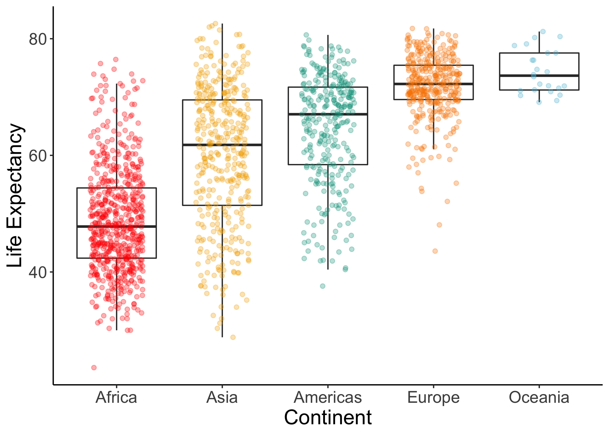
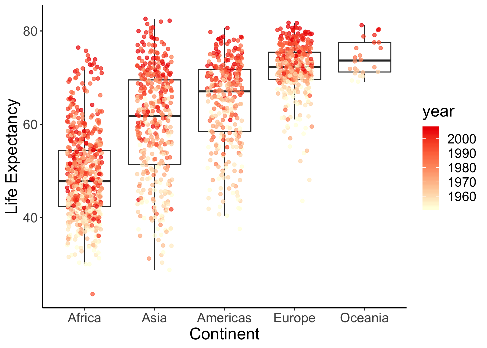

```{r setup, include=FALSE}
knitr::opts_chunk$set(echo = TRUE)
```
```{r}
suppressPackageStartupMessages(library(tidyverse))
suppressPackageStartupMessages(library(gapminder))
suppressPackageStartupMessages(library(DT))
suppressPackageStartupMessages(library(readxl))
suppressPackageStartupMessages(library(here))
suppressPackageStartupMessages(library(wesanderson))
suppressPackageStartupMessages(library(cowplot))
suppressPackageStartupMessages(library(ggthemes))
```


#Exercise 1: Explain the value of the here::here package

Read through the blog post by Malcolm Barrett where he outlines why one should use the here::here package in RStudio projects.

Task: In your own words, summarize the value of the here::here package in 250 words or fewer.

_The here::here function does wonders for ease of access and reproducibility when other people are running your code. It makes it so you don't have to set your working directory or type out file paths to retrieve or write files. Used in tandem with R projects, here::here makes it so easy for someone to clone your whole project and never have to worry about the code having problems based on where you saved certain files. It also makes it easier to tell R where to save your written files because you don't have to type out the entire file path. One of the most important aspects of here::here is that it works across all platforms with the same formatting and syntax, which is not the case for other file systems - for example Mac uses "/" to separate directories and Windows uses "\"_

#Exercise 2: Factor management

**Task**: Choose one dataset (of your choice) and a variable to explore. After ensuring the variable(s) you’re exploring are indeed factors, you should:

  1. Drop factor / levels;
  2. Reorder levels based on knowledge from data.

Explore the effects of re-leveling a factor in a tibble by:

  1. comparing the results of "arrange" on the original and re-leveled factor.
  2. Plotting a figure of before/after re-leveling the factor (make sure to assign the factor to an _aesthetic_ of your choosing).

These explorations should involve the data, the factor levels, and at least two figures (before and after).

###Elaboration for the gapminder data set
**Drop Oceania**. Filter the Gapminder data to remove observations associated with the continent of Oceania. Additionally, remove unused factor levels. Provide concrete information on the data before and after removing these rows and Oceania; address the number of rows and the levels of the affected factors.

_First I am filtering the dataset to remove rows from the continent Oceania - this is "gap1". Then I am using the droplevels() function to remove the factor "Oceania" from the dataset - this is "gap2". I am doing this in two steps so I can view if there are more levels after removing the Oceania continent that I am unaware of. It could be done in one pipe thread though._
```{r}
gap1 <- gapminder %>% 
  filter(continent %in% c("Americas", "Europe", "Asia", "Africa"))

gap2 <- gap1 %>% 
  droplevels()
```

_Here I am viewing the levels and number of rows for the original dataset as well as the filtered set and the one where I have removed unused levels. After filtering the dataset to remove the rows from Oceania, the number of rows decreases because rows are being removed. After dropping the levels, I can see that there is no change in number of rows, but "Oceania" is removed because no rows use that as their value for continent._

_First the levels and number of rows for the raw dataset._
```{r}
levels(gapminder$continent)
nrow(gapminder)
```

_Then the levels and number of rows for the filtered dataset._
```{r}
levels(gap1$continent)
nrow(gap1)
```

_And last the levels and number of rows for the filtered datset with unused levels dropped._
```{r}
levels(gap2$continent)
nrow(gap2)
```

**Reorder the levels of country or continent**. Use the forcats package to change the order of the factor levels, based on summarized information of one of the quantitative variables. Consider experimenting with a summary statistic beyond the most basic choice of the mean/median. Use the forcats package in the tidyverse for this, rather than the baseR function as.factor.

*I'll demonstrate that I am actually reordering the levels by using the levels() function as well as a bar graph. I will use the countries of the Americas to demonstrate this, so first I am filtering the dataset to just rows from the Americas I'm using the fct_reorder() function, and ordering the countries in the Americas by median life expectancy, which will make my boxplots much more easy to interpret.*
```{r}
gap_americas <-gapminder %>%
  filter(continent == "Americas") %>% 
  droplevels()

gap_ordered <- fct_reorder(.f = gap_americas$country, .x = gap_americas$lifeExp, .fun = median) %>% 
  droplevels()
```

_In the raw dataset, the factors are in alphabetical order as this is R's default._
```{r}
levels(gap_americas$country)
```

_Now I have ordered them in ascending median life expectancies._
```{r}
levels(gap_ordered)
```

_Now we'll view some boxplots to demonstrate what I did visually. First we'll look at the raw datset (ordered alphabetically)._
```{r}
gap_americas %>% 
  ggplot(aes(x = country, y = lifeExp))+
    geom_boxplot(fill = "powderblue")+
    coord_flip()+
    labs(y = "Life Expectancy", x = "Country")+
    theme_bw()
```

_And the dataset ordered by ascending median life expectanicies._  
```{r}
gap_americas %>% 
  ggplot(aes(x = fct_reorder(country, lifeExp, median), y = lifeExp))+
    geom_boxplot(fill = "powderblue")+
    coord_flip()+
    labs(y = "Life Expectancy", x = "Country")+
    theme_bw()
```


# Exercise 3: File input/output (I/O)

Task: Experiment with at least one of:

write_csv()/read_csv() (and/or TSV friends),
saveRDS()/readRDS(),
dput()/dget().
You are expected to create something new, probably by filtering or grouped-summarization of your dataset (for e.g., Singer, Gapminder, or another dataset), export it to disk and then reload it back in using one of the packages above. You should use here::here() for reading in and writing out.

With the imported data, play around with factor levels and use factors to order your data with one of your factors (i.e. non-alphabetically). For the I/O method(s) you chose, comment on whether or not your newly created file survived the round trip of writing to file then reading back in.

_I'll work with a summary table of the gapminder dataset. I'm going to use the summarize() function to make a dataset with the min, max, and average life expectancies for each country in Europe._
```{r}
mydata <- gapminder %>%
  filter(continent == "Europe") %>% 
  group_by(country) %>% 
  summarise(min_life = min(lifeExp),
            avg_life = mean(lifeExp),
            max_life = max(lifeExp))

mydata %>% 
  datatable()
```

_I'm going to write this dataset to a csv using the here::here() function._ 
```{r}
write_csv(mydata, here::here("exported_data.csv"))
```

_Now I'll call it something else as I read it back in from my disk so that I can compare the structure of the two datasets to make sure it survived the writing from and reading into R._
```{r message = FALSE}
mydata2 <- read_csv(here::here("exported_data.csv"))
```

_And now we can view the structure of the dataset before writing and after reading back in:_
```{r}
str(mydata)
```

_After reading back in we can see that these two outputs are mostly the same, but have some minor differences. There are the same number of rows and columns, and the same variable names and values. But the "country" variable is now a character class instead of a factor class._  
```{r}
str(mydata2)
```

#Exercise 4: Visualization design

Go back through your previous assignments and class participation activities and find figures you created prior to the last week of the course. Recreate at least one figure in light of something you learned in the recent class meetings about visualization design and color.

Task: Create a side-by-side plot and juxtapose your first attempt (show the original figure as-is) with a revised attempt after some time spent working on it and implementing principles of effective plotting principles. Comment and reflect on the differences.

*I made a simple boxplot from the gapminder dataset when I was completing Assignment 1. I'll call the original plot "p1" and display it as **Graph A**. I'm going to make some improvements for clarity and save it as "p2". I'm also going to make a similar graph adding another variable without making the graph much more complcated, thereby adding a lot more information, and call it "p3".Then I'll use cowplot::plot_grid() to make a side-by-side plot so it is easy to see the differences between the three.*

_Here I will list the first set of improvements shown in **Graph B**: remove the grey background and gridlines, add the datapoints on top of the boxes so as to be more transparent about the amount and distribution of data, increase the font size slightly, add some pleasing but not distracting color, and remove the outliers._

_**Graph C** has another improvement in that it adds more data to the data/ink ratio. I have included a color gradient to denote the year of each data point, so we get all the same information as the second graph with the **added** information of trends over time._
```{r fig.height=6, fig.width=18}
p1 <- ggplot(gapminder, aes(x=reorder(continent, lifeExp, FUN = median), y=lifeExp))+
  geom_boxplot()+
  labs(y="Life Expectancy", x="Continent")

p2 <- ggplot(gapminder, aes(x=reorder(continent, lifeExp, FUN = median), y=lifeExp))+
  geom_boxplot(outlier.alpha = 0)+
  geom_jitter(width = 0.25, alpha = 0.3, aes(color = continent))+
  labs(y="Life Expectancy", x="Continent")+
  theme_classic()+
  scale_color_manual(values=wes_palette(n=5, name="Darjeeling1"))+
  theme(legend.position = "none", text = element_text(size=17))

p3 <- ggplot(gapminder, aes(x=reorder(continent, lifeExp, FUN = median), y=lifeExp))+
  geom_boxplot(outlier.alpha = 0)+
  geom_jitter(width = 0.25, alpha = 0.7, aes(color = year))+
  labs(y="Life Expectancy", x="Continent")+
  theme_classic()+
  scale_color_gradient(low = "lightyellow", high = "red2")+
  theme(text = element_text(size=17))

(improved_plot <- plot_grid(p1, p2, p3, nrow = 1, labels = c('A', 'B', 'C'), label_size = 18))
```


#Exercise 5: Writing figures to file
Task: Use ggsave() to explicitly save a plot to file. Include the exported plot as part of your repository and assignment.

Then, load and embed the image into your report. You can play around with various options, such as:

Arguments of ggsave(), such as width, height, resolution or text scaling.
Various graphics devices, e.g. a vector vs. raster format.
Explicit provision of the plot object p via ggsave(..., plot = p). Show a situation in which this actually matters.

_Explicit provision of the plot object p via ggsave(..., plot = p) matters if you've been making many plots and you want to save a specific one at the end, but don't want to have to go back up and write the ggsave code inline_
```{r}
ggsave("plotA.png", plot = p1)
ggsave("plotB.png", plot = p2)
ggsave("plotC.png", plot = p3)
ggsave("improved_plot.png", width = 18, height = 6, units = "in", plot = improved_plot)
```

### Embedded image that I just saved






